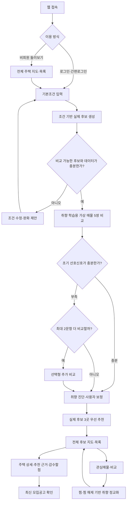
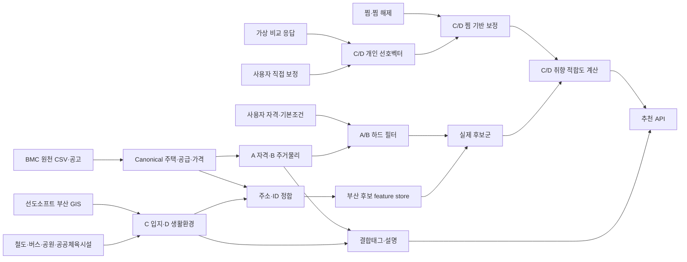

# 취향 기반 공공임대 추천 서비스 최종기획안

> 문서 버전: Final 1.3  
> 작성 기준일: 2026-07-25  
> 서비스명: **Be:live**  
> 문서 상태: 서비스 흐름·추천 구조·태그 체계 확정안  
> 기준 문서: `취향_기반_공공임대_추천서비스_기획안.docx`, 현재 MVP·추천 로직 논의 결과, `tag/최종_태그_체계_및_산출가이드.md`

---

## 0. 기획안 요약

이 서비스는 공공임대주택을 단순히 가격과 면적으로 검색하는 서비스가 아니다. 사용자가 신청·희망 조건으로 실제 후보를 먼저 좁힌 뒤, **기본 주택조건은 같고 생활환경만 다르게 통제한 가상 매물을 비교해 말로 설명하기 어려운 생활취향을 학습하고, 그 취향과 가까운 실제 공공임대 후보를 데이터 근거와 함께 추천하는 서비스**다.

핵심 흐름은 다음과 같다.

1. 사용자가 지역·예산·주택조건·필수조건을 입력한다.
2. 입력 조건으로 신청·거주 가능성이 없는 후보와 희망조건에 맞지 않는 후보를 먼저 제외한다.
3. 취향 학습용 가상 매물 카드 5쌍을 비교한다.
4. 선택 결과로 개인별 초기 선호벡터를 만든다.
5. 사용자가 추정 결과를 확인하고 직접 보정한다.
6. 실제 공공임대 후보를 생활취향 적합도순으로 추천한다.
7. 추천 이유, 감수할 점, 데이터 근거를 함께 제공한다.
8. 찜·찜 해제 행동만 이용해 초기 취향을 보수적으로 정교화한다.

추천 데이터의 역할은 다음처럼 고정한다.

- **A 자격·유형:** 신청 가능성 확인과 하드필터
- **B 주거물리:** 예산·면적·방수·필수시설 등 희망조건 필터와 사실 표시
- **C 입지·교통, D 생활환경:** 개인별 취향학습과 실제 후보 순위
- **결합태그:** 추천 사유·탐색·카드 문구 전용이며 추천점수 기여도는 0

### 한 문장 정의

> **조건에 맞는 공공임대 중에서, 내가 실제로 살아갈 동네의 모습까지 비교해 우선 확인할 집을 찾아주는 설명 가능한 추천 서비스**

### 핵심 차별점

- 부산도시공사 공공임대 실데이터와 선도소프트 생활환경 GIS 데이터의 결합
- 정량 조건 필터링과 정성적 생활취향 학습의 분리
- 직접 태그를 고르게 하는 대신 통제된 가상 매물 비교를 통한 자연스러운 선호 추론
- 개인별 pairwise 선호학습을 이용한 후보 순위 산출
- A/B 필터와 C/D 취향벡터, 결합태그 설명 계층의 명확한 분리
- 찜 행동만 사용하는 설명 가능하고 보수적인 지속 정교화
- 추천 이유와 불리한 점을 함께 제공하는 설명 가능한 추천
- 자격판정·당첨확률·주택 품질점수와 생활취향 추천을 명확하게 구분

---

## 1. 추진 배경

### 1.1 현재 공공임대 탐색의 문제

공공임대 정보는 주로 다음과 같은 정량정보를 중심으로 제공된다.

- 임대유형
- 보증금과 월 임대료
- 전용면적과 방수
- 공급대상과 신청 자격
- 모집일정

이 정보는 신청 가능성과 경제적 조건을 확인하는 데 필수적이지만, 실제 거주 선택에서 중요한 다음 질문에는 충분히 답하지 못한다.

- 이 동네에서 퇴근 후 어떤 생활을 할 수 있는가?
- 생활편의시설을 도보로 이용할 수 있는가?
- 활기찬 상권과 조용한 주거환경 중 어느 쪽에 가까운가?
- 내가 중요하게 생각하는 생활환경을 가진 후보가 어디인가?
- 비슷한 가격과 면적의 후보 중 무엇을 먼저 확인해야 하는가?

사용자는 이를 확인하기 위해 공고, 지도, 블로그, 거리뷰와 여러 부동산 서비스를 반복해서 탐색해야 한다. 그 결과 탐색 비용이 커지고, 주소나 지역의 이미지에 의존해 생활환경을 추측하게 된다.

### 1.2 해결하려는 문제

> **신청·희망 조건을 만족하는 공공임대 후보 중에서 어떤 집이 사용자의 생활방식과 더 잘 맞는지 설명할 수 있는가?**

서비스는 모든 사용자가 자신의 취향을 정확한 단어와 가중치로 표현할 수 있다고 가정하지 않는다. 대신 서로 다른 생활환경을 비교하게 하고, 반복된 선택에서 상대적 선호를 학습한다.

---

## 2. 서비스 목표와 비목표

### 2.1 목표

1. 공고와 지도에 흩어진 정보를 한 흐름에서 탐색하게 한다.
2. 정량 조건과 생활취향을 분리해 추천 결과의 의미를 명확하게 한다.
3. 짧은 비교만으로 사용자의 초기 생활취향 방향을 추정한다.
4. 서로 다른 취향이 실제 후보 순위와 추천 이유의 차이로 이어지게 한다.
5. 각 추천의 데이터 근거와 한계를 사용자가 확인할 수 있게 한다.
6. 온보딩 이후에는 찜·찜 해제만으로 취향을 보수적으로 정교화한다.
7. 부산도시공사가 지역·공급유형별 수요 특성을 집계 수준에서 이해할 수 있게 한다.

### 2.2 비목표

- 추천 점수로 신청 자격을 최종 확정하지 않는다.
- 추천 점수로 당첨 가능성을 예측하지 않는다.
- 데이터가 없는 남향, 실내 소음, 관리비, 반려동물 허용 등을 임의로 추정하지 않는다.
- 5회의 비교만으로 사용자의 취향을 완전히 학습했다고 표현하지 않는다.
- 상세조회·체류시간·공고 열기·미클릭은 개인 추천학습에 사용하지 않는다.
- 찜 한두 개가 온보딩·직접 보정 결과를 덮어쓰게 하지 않는다.
- 생활취향과 무관한 가격·신축 여부를 숨은 추천 보너스로 중복 반영하지 않는다.

---

## 3. 핵심 사용자

### 3.1 1차 사용자

- 공공임대 신청을 고려하지만 여러 후보를 비교하기 어려운 사람
- 자격과 예산 외에 주변 생활환경을 중요하게 생각하는 사람
- 낯선 지역의 생활환경을 직접 조사할 시간이 부족한 사람
- 자신의 주거취향을 구체적인 단어로 설명하기 어려운 사람
- 조건에 맞는 후보가 여러 개일 때 무엇부터 확인해야 할지 모르는 사람

### 3.2 2차 사용자

- 가족의 공공임대 탐색을 돕는 보호자
- 상담 과정에서 여러 후보를 설명해야 하는 부산도시공사 담당자
- 입주포기·미달·관심지역의 원인을 파악하려는 정책 담당자

### 3.3 대표 사용 상황

> 사용자는 보증금과 월세 범위, 희망 지역, 면적과 필수시설을 입력한다. 조건을 만족하는 주택이 여러 개 남으면 기본 주택조건은 같고 생활환경만 다른 가상 매물 5쌍을 비교한다. 서비스는 선택에서 발견한 생활취향을 요약하고 실제 후보 3곳을 먼저 보여준다. 사용자는 왜 추천되었는지와 감수할 점을 확인한 뒤 전체 지도, 상세정보, 모집공고로 이동한다.

---

## 4. 제품 설계 원칙

### 4.1 조건과 취향을 분리한다

- 가격·면적·방수·지역·필수시설은 후보를 거르는 조건이다.
- 생활환경은 조건을 통과한 후보의 순서를 만드는 취향 정보다.
- 같은 정보를 필터와 추천 점수에 동시에 넣어 중복 반영하지 않는다.
- A 자격·유형과 B 주거물리는 필터·사실 계층으로 사용한다.
- 개인 선호모델은 C 입지·교통과 D 생활환경의 확정된 원자 특징만 학습한다.
- 결합태그는 원자 특징을 사람이 이해하기 쉽게 요약하며 추천점수에는 다시 더하지 않는다.

### 4.2 비교 화면에서는 정량 조건의 영향을 통제한다

가상 매물 비교에서 보증금, 월세, 면적, 방수, 준공연도와 임대유형은 두 카드 사이의 선택 원인이 되지 않게 동일하게 유지한다. 개별 가격 대신 `내 예산·면적·필수조건 충족`을 공통으로 표시하고, 유형·주택형을 타이틀에 표시할 경우에도 A와 B에 같은 값을 사용한다. 실제 매물명·주소·실제 건물사진은 표시하지 않는다.

이를 통해 비교 단계에서는 사용자가 가격이나 넓이에 끌려 선택하는 것을 막고, 생활방식 차이에 집중하게 한다.

### 4.3 취향 학습용 가상 매물을 사용한다

- 특정 실제 매물의 특성에 얽매이지 않는다.
- 서로 비교할 가치가 있는 생활환경 차이를 의도적으로 구성한다.
- 실제 부산 후보에서 관측된 데이터 범위 안에서 카드를 만든다.
- 현실에 존재하기 어려운 모든 장점의 조합은 만들지 않는다.
- 카드 외형은 매물처럼 구성하되 분석에는 통제된 생활환경 차이만 사용한다.
- 모든 카드에 `취향 학습용 가상 매물`임을 명시한다.

### 4.4 짧고 수정 가능한 학습을 지향한다

- 필수 비교는 5문항으로 제한한다.
- 신호가 부족한 경우에만 선택형 추가 문항을 최대 2개 제공한다.
- 이전 문항으로 돌아가 응답을 바꿀 수 있다.
- 추정 결과를 사용자가 직접 수정할 수 있다.
- 사용자의 직접 수정은 모델의 추정보다 우선한다.

### 4.5 추천을 설명한다

각 추천은 다음 네 가지를 함께 제공한다.

1. 조건을 어떻게 충족했는가
2. 어떤 생활취향이 추천에 가장 크게 반영되었는가
3. 이를 뒷받침하는 거리·개수·분포상의 위치는 무엇인가
4. 사용자가 중요하게 여길 수 있는 감수할 점은 무엇인가

### 4.6 불확실성을 숨기지 않는다

- 데이터 미보유와 실제 부재를 구분한다.
- 커버리지가 부족하면 정밀한 점수를 표시하지 않는다.
- 추천 점수가 자격·당첨확률이 아님을 반복해서 안내한다.
- 최신 모집공고의 최종 확인을 요구한다.

---

## 5. 전체 서비스 흐름



### 서비스 단계

| 단계 | 사용자 행동 | 서비스 처리 | 핵심 산출물 |
|---|---|---|---|
| 1 | 로그인 또는 비회원 진입 | 세션 생성 | 탐색 상태 |
| 2 | 기본조건 입력 | 하드 필터 적용 | 실제 후보군 |
| 3 | 가상 매물 비교 | 개인별 선호학습 | 초기 선호벡터 |
| 4 | 취향 결과 확인·수정 | 직접 보정 반영 | 최종 선호벡터 |
| 5 | 실제 후보 추천 | 적합도 계산·정렬 | 우선 후보 3곳 |
| 6 | 지도·상세·비교 | 근거와 감수할 점 생성 | 탐색·의사결정 |
| 7 | 찜·찜 해제 | 온보딩 취향을 제한적으로 보정 | 정교화된 선호벡터 |

---

## 6. 단계별 상세 UX

### 6.1 진입·로그인

#### 목적

추천 체험으로 빠르게 진입시키고, 로그인 때문에 이탈하지 않게 한다.

#### 구성

- 서비스 가치 제안
- 간편로그인
- 비회원으로 전체 주택 둘러보기
- 데이터 출처와 추천 의미 안내

#### 운영 원칙

- MVP 로그인은 데모 세션으로 구현할 수 있다.
- 비회원은 전체 목록을 볼 수 있다.
- 개인화 결과 저장과 관심매물 동기화는 로그인 사용자에게 우선 제공한다.

### 6.2 1단계 — 기본조건 입력

#### 목적

비교 전에 양보하기 어려운 정량 조건을 적용하여 실제 후보군을 만든다.

#### 입력 범위

- 희망 지역
- 보증금 상한
- 월 임대료 상한
- 임대유형
- 전용면적 범위
- 방 구조
- 준공연도 범위
- 승강기 필수 여부
- 주차 필수 여부
- 자격 확인에 필요한 최소 입력

#### 처리 원칙

- 조건을 충족하지 못한 후보는 취향 비교와 랭킹 전에 제외한다.
- A 자격은 `신청 가능성 높음`, `추가 확인 필요`, `조건상 제외`, `공고 확인 필요`의 네 상태로 관리한다.
- 조건부 가격은 공급계층·소득구간·가구원수·신청순위에 맞는 행을 선택한다.
- 여러 가격 행을 중앙값으로 합쳐 사용자 가격처럼 사용하지 않는다.
- 자격 데이터가 부족한 후보는 `신청 가능`으로 단정하지 않고 `공고 확인 필요`로 남긴다.
- B의 가격·면적·방수·승강기·주차는 조건 통과 후 숨은 추천 보너스로 다시 가산하지 않는다.
- 후보가 0개 또는 비교가 불가능할 정도로 적으면 조건 완화를 제안한다.
- 서비스가 사용자 동의 없이 조건을 자동으로 변경하지 않는다.

#### 화면 피드백

- 현재 조건을 만족하는 후보 수
- 생활환경 데이터가 있는 후보 수
- 조건별 제외 후보 수
- 0건인 경우 가장 큰 제약 조건
- `조건 초기화`, `일부 조건 수정`

### 6.3 2단계 — 취향 학습용 가상 매물 비교

#### 사용자 표현

서비스 화면에서는 `A/B 테스트`, `스와이프 학습`, `틴더형 추천` 대신 다음 표현을 사용한다.

- `생활방식 비교`
- `어떤 일상이 더 끌리나요?`
- `내 생활취향 알아보기`

#### 기본 문항 수

- 핵심 문항: 5개
- 선택형 추가 문항: 최대 2개
- 목표 완료 시간: 약 1분

10개를 모두 필수로 제시하지 않는 이유는 짧은 온보딩에서 응답 피로와 무성의 선택이 늘어날 수 있기 때문이다. 핵심 문항은 각기 다른 정보를 갖도록 설계하고, 부족한 정보만 추가 질문으로 보완한다.

#### 카드 구성

각 카드는 실제 매물 카드와 비슷한 정보 위계를 사용하되, 실제 매물로 오해하지 않도록 가상 표시를 고정한다.

1. 대표 이미지
2. `취향 학습용 가상 매물` 배지와 A/B 구분
3. 자연스러운 문장형 타이틀 1줄
4. 하루나 주말을 떠올릴 수 있는 장면 설명
5. 이 환경에서 기대할 수 있는 생활 특성
6. 감수할 점
7. `내 예산·면적·필수조건 충족` 공통 안내
8. `이 매물이 더 끌려요` 선택 버튼

실제 주택명·상세주소·실제 건물사진·개별 가격·자격정보는 표시하지 않는다. 임대유형과 주택형·면적 수준을 보여줄 경우 A와 B에 같은 값을 사용한다.

#### 대표 이미지

- 실제 매물사진이 아닌 가상 생활환경 일러스트나 추상적 지역 이미지를 사용한다.
- A와 B의 카메라 구도·크기·밝기·채도·화풍·정보량을 동일한 수준으로 맞춘다.
- 실제 상호명·건물명·랜드마크·브랜드 로고를 제거한다.
- 한쪽만 신축이거나 고급주택처럼 보이지 않게 건물의 외관 품질을 통제한다.
- 이미지를 확보하지 못하면 동일한 디자인 템플릿의 `임대유형+지역` 썸네일을 사용한다.
- 대체 썸네일도 A/B의 색상 강도와 시각적 매력도를 같게 유지한다.
- 이미지에는 의미 있는 대체텍스트를 제공한다.

대표 이미지의 목적은 실제 매물을 재현하는 것이 아니라 사용자가 생활 장면을 쉽게 떠올리게 하는 것이다. 이미지 차이는 모델 feature로 사용하지 않는다.

#### 자연스러운 문장형 타이틀

타이틀은 `[생활권] · 임대유형 · 주택형`을 기계적으로 나열하지 않고 하나의 생활문장으로 보여준다.

```text
{지역·생활권}의 {핵심 생활가치}를 {생활동사} {임대유형} {주택형}
```

예시:

- `철도와 카페 생활을 가까이 누리는 행복주택 원룸`
- `조용한 주택가에서 여유롭게 쉬는 행복주택 원룸`
- `공원 산책을 일상처럼 즐기는 통합공공임대 투룸`
- `마트와 외식 생활을 가까이에서 누리는 매입임대 투룸`

실제 동명을 사용할 수 있지만 다음 기준을 지킨다.

- 생활취향만 측정하는 문항에서는 실제 동명보다 `대학가 생활권`, `조용한 주거생활권`처럼 일반화한 표현을 우선한다.
- 실제 지역명을 표시하면 A와 B에 같은 지역을 사용하거나, 지역 차이 자체를 측정하는 문항임을 명시한다.
- 사용자가 기본조건에서 선택한 지역을 공통 맥락으로 보여줄 수 있지만 A/B의 차이로 사용하지 않는다.
- `수영구에서 철도와 카페 생활을 가까이 누리는 행복주택 원룸`처럼 실제 지역명을 쓸 때도 `취향 학습용 가상 매물` 배지를 항상 함께 표시한다.

#### 카드 표시 예시

```text
┌────────────────────────────────────┐
│ [대표 이미지]                       │
│ 취향 학습용 가상 매물 A              │
├────────────────────────────────────┤
│ 철도와 카페 생활을 가까이 누리는       │
│ 행복주택 원룸                        │
│                                    │
│ 카페와 생활시설이 가까워              │
│ 외출 동선이 짧은 생활이에요.          │
│                                    │
│ [도시철도 가까움] [카페 선택지]       │
│ [밤에도 활기찬 주변]                  │
│                                    │
│ 감수할 점                           │
│ 저녁에도 주변의 활기가 이어질 수 있어요.│
│                                    │
│ ✓ 내 예산·면적·필수조건 충족          │
│                                    │
│      이 매물이 더 끌려요 →            │
└────────────────────────────────────┘
```

#### 응답

| 응답 | 해석 | MVP 처리 |
|---|---|---|
| A가 더 끌려요 | A가 B보다 상대적으로 선호됨 | 개인 선호모델 갱신 |
| B가 더 끌려요 | B가 A보다 상대적으로 선호됨 | 개인 선호모델 갱신 |
| 둘 다 비슷해요 | 현재 차이가 사용자에게 중요하지 않음 | 가중치 미갱신, 별도 로그 |
| 둘 다 내 생활과 달라요 | 두 선택지 모두 절대적으로 맞지 않음 | 상대모델 미갱신, 별도 로그·결과 보정에서 확인 |

#### 내비게이션

- 진행률 표시
- 이전 질문
- 다음 질문
- 건너뛰기 또는 비교 종료
- 선택 수정 시 이후 선호벡터 전체 재계산

`이전 질문`은 화면만 이동하는 기능이 아니다. 직전 응답을 취소하고 남아 있는 응답으로 개인 선호모델을 처음부터 다시 계산한다.

### 6.4 비교문항 구성 원칙

#### 1. 한 문항에는 한 가지, 많아도 두 가지 핵심 차이만 둔다

카드에 너무 많은 차이를 넣으면 사용자가 무엇 때문에 선택했는지 알 수 없다.

- 단일축 문항: 한 가지 생활환경의 양쪽 모습을 비교
- 트레이드오프 문항: 서로 다른 두 장점 중 무엇을 우선하는지 비교

#### 2. 지배적인 카드를 만들지 않는다

A가 모든 면에서 B보다 좋은 문항은 취향이 아니라 상식적 선택을 측정한다. 트레이드오프 문항은 A와 B가 각각 다른 장점을 가지도록 구성한다.

#### 3. 실제 데이터 범위를 따른다

- 후보 데이터의 하위·중앙·상위 분포를 이용해 가상 매물의 생활환경을 구성한다.
- 부산 데이터에서 관측되지 않은 극단적 조합은 사용하지 않는다.
- 필터 후보가 적으면 전체 데이터 중 동일 지역·유형의 관측 범위를 참조한다.
- 실제 데이터가 없는 특성은 질문하지 않는다.

#### 4. 위치편향을 관리한다

- A와 B의 시각적 크기와 정보량을 동일하게 한다.
- 세션별 좌우 순서를 무작위화한다.
- 한쪽에만 더 매력적인 이미지나 강조색을 사용하지 않는다.
- 대표 이미지의 구도·밝기·화풍을 균형 있게 맞춘다.
- 타이틀의 길이·문장구조·감정 강도를 비슷하게 맞춘다.
- 임대유형·주택형·면적 수준은 동일하게 통제한다.
- 실제 지역명이 한쪽 선택에만 영향을 주지 않게 한다.
- 좌우 선택 비율을 품질지표로 모니터링한다.

#### 5. 같은 문항을 좌우만 바꿔 반복하지 않는다

짧은 비교 횟수는 새로운 취향을 파악하는 데 사용한다. 선택 일관성은 상세조회, 찜, 재비교와 장기 행동을 이용한 성과평가에서 확인하되, 개인 추천의 후속 갱신에는 찜·찜 해제만 사용한다.

#### 6. 핵심 5문항 구조

- 1~3회: 철도 접근, 도심 활동성, 조용함·공원처럼 큰 생활방향을 구분하는 문항
- 4~5회: 카페·운동·마트·외식·문화 등 실제 후보의 분산이 큰 세부축을 구분하는 트레이드오프 문항
- 추가 1~2회: 현재까지 신호가 약하거나 후보 간 구분력이 큰 영역을 묻는 선택형 문항

질문 레지스트리는 확정된 8개 핵심 취향 특징을 기준으로 관리한다. 한 세션에서 모든 특징을 억지로 한 번씩 묻지 않고, 후보군의 특징 분산과 현재까지의 선호 불확실성을 이용해 정보량이 큰 질문을 고른다.

### 6.5 3단계 — 취향 진단과 직접 보정

#### 목적

모델의 추정을 확정적 진단으로 보여주지 않고, 사용자가 이해하고 수정할 수 있게 한다.

#### 표시 내용

1. **결합형 취향 설명**
   - 여러 선호를 이해하기 쉬운 한 문장으로 요약한다.
   - 성격검사처럼 영구적인 유형으로 표현하지 않는다.
   - 추천 계산값과 별도의 설명용 프로필로 사용한다.

2. **생활취향의 큰 방향**
   - `우선`, `보통`, `탐색 중`, `후순위`와 같은 상태로 표현한다.
   - 5회의 선택으로 정밀한 백분율을 학습했다고 표현하지 않는다.

3. **직접 보정**
   - 우선순위 조정
   - 잘못 추정된 방향 끄기
   - 빠진 선호 추가
   - 비교 다시 하기
   - 기본조건 수정

#### 보정 원칙

- 사용자의 명시적 수정은 추론 결과보다 우선한다.
- 수정 이력은 추천 결과에 즉시 반영한다.
- 사용자가 수정한 항목에는 `직접 설정` 표시를 제공한다.
- 추론 결과와 수정 결과를 구분해 로그한다.

### 6.6 4단계 — 실제 후보 3곳 우선 추천

#### 목적

모든 후보를 바로 보여주기보다 사용자가 먼저 살펴볼 가치가 있는 실제 후보를 제시한다.

#### 카드 정보

- 후보 순위
- 실제 주택명
- 임대유형과 지역
- 보증금·월 임대료
- 주요 주택조건
- 생활취향 적합도
- 추천 이유 결합태그와 원자 특징 근거
- 감수할 점
- 자격·공고 확인 상태
- 관심매물 저장

#### 표시 원칙

- `회원님과 82% 일치`처럼 확률로 오해될 표현을 피한다.
- `생활취향 적합도 82` 또는 `후보 내 취향순위`로 표시한다.
- `자격·당첨확률 아님`을 점수 근처에 표시한다.
- 데이터 근거가 부족하면 수치 대신 `데이터 확인 필요`를 표시한다.

### 6.7 5단계 — 전체 후보 지도·목록

#### 지도

- 실제 주택 위치
- 생활취향 적합도 마커
- 선택 후보 강조
- 현재 지도 영역과 목록 연동
- 데이터 커버리지 안내

#### 목록

- 조건을 통과한 전체 후보
- 적합도순·가격순·거리순 정렬
- 빠른 조건 필터
- 관심매물 저장
- 후보 간 비교

#### 동일 후보 문제에 대한 원칙

서로 다른 취향이어도 하드 필터 후보가 매우 적거나 생활환경 데이터의 차이가 작으면 상위 후보가 일부 같을 수 있다. 이 경우 순위를 인위적으로 바꾸지 않고 다음을 제공한다.

- 후보 간 점수차
- 취향별 추천 이유의 차이
- 순위 변화 여부
- 현재 후보군이 제한적인 이유
- 조건을 조정했을 때 새로 포함되는 후보

다만 데이터상 충분한 차이가 있는데도 반대 취향에서 항상 같은 순위가 나오는 경우는 추천 로직 오류로 판단한다.

### 6.8 6단계 — 상세·비교·관심매물

#### 상세 화면 정보 우선순위

1. 현재 모집·공고 상태
2. 사용자 기본조건 충족 여부
3. 생활취향 추천 이유
4. 감수할 점
5. 근거가 되는 주변환경 데이터
6. 주택 기본정보와 비용
7. 최신 모집공고 원문

#### 관심매물

- 찜한 후보 모아보기
- 후보별 조건·비용·추천 이유 비교
- 관심 해제와 실행취소
- 공고 열기
- 찜한 후보의 생활환경 특성을 초기 취향에 소폭 반영
- 찜 해제 시 해당 찜이 만든 보정분을 취소
- `최근 찜이 추천에 반영됨` 안내와 학습 초기화 기능

---

## 7. 개인 선호학습 설계

### 7.1 학습 대상

사용자별로 추정하는 값은 생활환경 feature에 대한 상대적 선호 가중치 벡터다.

MVP의 개인 선호벡터는 다음 8개 원자 특징으로 고정한다.

| 특징 ID | 의미 |
|---|---|
| `rail_access` | 도시철도 접근성 |
| `cafe_choice` | 카페 선택지 |
| `fitness_access` | 운동시설 접근성 |
| `supermarket_access` | 마트 접근성 |
| `restaurant_choice` | 외식 선택지 |
| `culture_access` | 문화·여가 접근성 |
| `quiet_residential` | 조용한 주거환경 추정 |
| `park_walk` | 공원 산책 접근성 |

`metro_access`, `donghae_access`, `bgl_access`, `transfer_access`는 `rail_access`를 설명하는 구성요소다. `cvs_access`, `market_complex_access`, `laundry_access`, `retail_access`, `nightlife_access`는 설명·결합·반대축 근거로 산출하되 MVP의 독립 선호가중치로 중복 학습하지 않는다.

A 자격·유형, B 가격·면적·방수·준공·승강기·주차, 결합태그는 `w_user`에 포함하지 않는다.

```text
w_user = [w₁, w₂, ..., wₖ]
```

각 가상 매물의 통제된 생활환경도 동일한 feature 공간의 벡터로 표현한다.

```text
x_A = 가상 환경 A의 feature 벡터
x_B = 가상 환경 B의 feature 벡터
```

### 7.2 Pairwise Logistic 모델

사용자가 A를 B보다 선호할 확률을 다음과 같이 본다.

```text
P(A > B) = sigmoid(w_user · (x_A - x_B))
```

A 또는 B를 선택할 때마다 해당 사용자의 `w_user`를 온라인으로 갱신한다.

```text
w ← (1 - ηλ)w + η(y - p)(x_A - x_B)
```

- `η`: 학습률
- `λ`: 소수 응답에서 특정 feature로 과도하게 쏠리는 것을 막는 규제
- `y`: A 선택이면 1, B 선택이면 0
- `p`: 현재 모델이 계산한 A 선택확률

학습률과 규제값은 운영 중 임의로 변경하지 않고 `model_version`과 함께 관리한다.

### 7.3 초기값과 Warm Start

비교를 시작하기 전 모든 사용자를 완전히 빈 벡터로 시작하면 첫 몇 문항의 영향이 지나치게 커질 수 있다. 이를 완화하기 위해 약한 초기 prior를 사용한다.

#### MVP

- 전체 사용자에게 중립적인 global prior를 사용한다.
- 사전 제작한 페르소나는 질문·추천 민감도 검증과 데모 시뮬레이션에 사용한다.
- 나이·소득·가구형태만으로 사용자의 취향 페르소나를 단정하지 않는다.
- 개인의 실제 선택이 prior보다 우선하도록 prior 강도를 낮게 둔다.

#### 데이터 축적 이후

- 전체 prior
- 선택한 사용자군 prior
- 개인의 pairwise 선택
- 찜·찜 해제 행동

을 서로 다른 계층으로 관리하는 계층적 학습 방식을 검토한다. 집단 prior가 개인 선호를 덮어쓰지 않도록 개인 응답이 쌓일수록 prior 영향은 감소시킨다.

### 7.4 짧은 비교의 해석 한계

5회의 비교는 개인의 모든 주거취향을 통계적으로 확정하기에 충분하지 않다. 따라서 다음 표현을 금지한다.

- `당신의 취향을 완벽하게 학습했습니다`
- `정확도 95%`
- `당신은 반드시 이 유형입니다`
- 세부 feature별 정밀한 백분율

허용 표현은 다음과 같다.

- `선택에서 이런 방향이 먼저 보였어요`
- `현재 선택에서는 이 생활을 상대적으로 더 중요하게 봤어요`
- `추천을 사용하며 언제든 수정할 수 있어요`

### 7.5 초기 신호 수준

다음 정보를 결합해 UX용 신호 수준을 판단한다.

- 유효 A/B 선택 수
- 서로 다른 비교영역의 수
- 가중치의 분리 정도
- `비슷해요` 응답 수
- `둘 다 다르다` 응답 수
- 필터 후보의 feature 분산

표시 문구:

- `초기 방향이 비교적 선명해요`
- `몇 가지 방향이 보이기 시작했어요`
- `아직 선택 신호가 적어요`

이는 통계적 신뢰구간이나 정확도 확률이 아니다.

### 7.6 사용자 보정과의 결합

Pairwise 모델은 말로 표현하기 어려운 초기 방향을 제공한다. 사용자가 결과 화면에서 직접 수정한 내용은 강한 명시적 신호로 처리한다.

```text
최종 선호 = pairwise 추정 + 사용자 직접 보정
```

구현 시에는 직접 보정이 해당 feature의 방향을 뒤집거나 비활성화할 수 있어야 한다. 사용자가 명시적으로 바꾼 값을 모델이 즉시 원상복구하지 않게 한다.

---

## 8. 실제 후보 추천 로직

### 8.1 후보군 생성

사용자 `u`의 후보군은 다음 조건을 통과한 실제 주택으로 구성한다.

```text
C(u) = A에서 제외되지 않음 ∩ B 기본조건 통과 ∩ 실제 BMC 후보
```

생활환경 데이터 커버리지는 후보의 존재 여부가 아니라 정밀 랭킹·설명 가능 여부를 결정한다. 데이터가 부족한 후보를 생활환경이 나쁜 후보로 제외하지 않고 `데이터 확인 필요`로 유지한다.

후보별 자격 상태는 다음처럼 분리한다.

- `likely_eligible`: 구조화된 필수조건을 모두 통과한 신청 가능성 높음
- `conditional`: 일부 서류·가구·지역·자산 조건의 추가 확인 필요
- `ineligible`: 명시된 필수조건 하나 이상 불충족
- `unverified`: 공고 규칙 또는 사용자 정보 부족으로 공고 확인 필요

구조화되지 않은 자격정보가 남아 있으면 최종 신청 가능으로 단정하지 않는다.

### 8.2 주택 feature

각 실제 후보 `h`는 가상 매물 카드의 생활환경과 동일한 feature 공간으로 표현한다.

```text
φ(h) = [φ₁(h), φ₂(h), ..., φₖ(h)]
```

- C/D 시설 접근성은 거리감쇠 합을 feature별 고정 포화함수로 변환한 0~1 점수를 사용한다.
- 후보가 355개(부산 전역)여도 동일한 거리와 시설구성이 같은 점수를 갖도록 후보 내 백분위를 사용하지 않는다.
- 원점수, 최근거리, 반경 내 시설 수, 거리산식, 데이터 기준일을 함께 저장한다.
- 조용함의 인구항은 후보 목록이 아닌 제공된 원천 인구격자 전체의 CDF를 사용한다.
- 관측되지 않은 feature를 0으로 간주하지 않는다.

### 8.3 취향 적합도

관측된 feature만 이용해 가중합을 계산한다.

```text
Score(h, u)
= Σ |wⱼ| × fitⱼ(h) / Σ |wⱼ|
```

- 선호 방향이면 해당 feature가 높을수록 적합도가 높다.
- 회피 방향이면 반대 방향의 값을 사용한다.
- 결측 feature는 분자와 분모에서 모두 제외한다.
- 관측 feature가 부족하면 점수와 함께 낮은 커버리지를 표시하거나 점수를 숨긴다.
- 데이터 커버리지가 크게 다른 후보는 정밀한 한 줄 순위를 단정하지 않고 `데이터 확인 필요`를 함께 표시한다.

MVP의 정밀 추천 표시 기준은 핵심 8개 특징 중 6개 이상 관측으로 시작한다. 이 기준은 `model_version`으로 관리하고 부산 전체 데이터 적용 후 커버리지 분포를 확인해 검증한다.

### 8.4 순위

1. 하드 필터 통과 여부
2. 정밀 추천에 필요한 데이터 커버리지 충족 여부
3. 생활취향 적합도
4. 동점 처리 기준

순으로 정렬한다.

가격이 상한보다 얼마나 저렴한지, 준공연도가 얼마나 최근인지 등 이미 필터에 사용한 값은 숨은 보너스로 더하지 않는다.

커버리지가 기준보다 낮은 후보는 제거하지 않되 정밀 적합도 순위군과 분리해 `추가 데이터 확인 후보`로 제공한다.

### 8.5 상위 후보 다양성

적합도가 거의 같은 후보가 동일 단지·동일 유형에 집중될 경우 다음 후보를 함께 탐색할 수 있도록 다양화한다.

- 적합도 차이가 작은 후보에 한해 지역·임대유형·주택형의 중복을 줄인다.
- 다양화가 원래 적합도 순위를 크게 훼손하지 않게 상한을 둔다.
- `취향순`과 `다양하게 보기`를 구분할 수 있다.

### 8.6 추천 이유

추천 이유는 실제 점수 기여도가 큰 feature를 기준으로 생성한다.

구성:

- 사용자의 어떤 선택이 반영되었는가
- 후보가 해당 feature에서 어느 수준인가
- 이를 뒷받침하는 실제 데이터는 무엇인가
- 추천 점수에 얼마나 기여했는가

설명문과 실제 계산 feature가 다르면 안 된다.

원자 특징의 근거가 함께 높을 때는 결합태그를 설명 문구로 사용할 수 있다.

- `역세권 생활편의`
- `대중교통형 액티브 라이프`
- `교통도 챙긴 조용한 주거지`
- `역세권 공원생활`
- `조용한 숲세권`
- `생활편의형 공원생활`
- `콤팩트 역세권`
- `콤팩트 생활편의`
- `새집에 가까운 조용한 주거`
- `대중교통형 문화생활`

결합태그는 구성요소의 기하평균과 구성요소 하한을 통과할 때만 붙인다. 결합태그 자체의 추천점수 기여도는 항상 0이며, 원자 특징에 더해 다시 가산하지 않는다.

### 8.7 감수할 점

사용자가 중요하게 본 feature 중 후보가 상대적으로 약한 부분을 제시한다.

- 후보의 절대적 결함으로 표현하지 않는다.
- 다른 상위 후보와 비교한 상대적 열세임을 명시한다.
- 데이터가 없어서 판단할 수 없는 경우에는 `확인 필요`로 표시한다.

---

## 9. 데이터 설계

### 9.1 부산도시공사 제공 데이터

#### 역할

- 실제 공공임대 후보 생성
- 임대유형·주소·주택 기본정보 제공
- 조건부 보증금·월 임대료 연결
- 기본조건 필터링
- 지도·목록·상세 화면 구성

#### 처리 원칙

- 서로 다른 임대유형 CSV를 canonical schema로 통합한다.
- 주택, 주택형, 세대, 가격조건을 분리한다.
- 가격은 공급계층·소득·가구원수·순위 조건을 보존한다.
- 원천 행과 산출 행의 추적 가능성을 유지한다.
- 기준일과 원천 파일명을 저장한다.

### 9.2 선도소프트 제공 데이터

#### 역할

- 주택 주변 생활환경 측정
- 업종별 시설의 거리·개수·밀집도 계산
- 인구·생활밀도 분석
- 상권과 주거지역의 공간적 특성 설명
- 가상 매물 카드에 사용되는 생활환경의 실제 데이터 범위 제공

#### 처리 원칙

- 제공 지역 밖으로 값을 임의 확장하지 않는다.
- 격자와 POI의 중복 신호를 추천 점수에 이중 반영하지 않는다.
- 직선거리와 실제 보행거리의 차이를 안내한다.
- 공간 조인의 좌표계와 기준 반경을 버전 관리한다.
- 인구밀도 격자에 포함되는 후보(현재 355개 전부)에 D의 POI 특징을 계산하고, 용도지역 격자는 조용함(quiet)의 zone항에만 쓴다.
- 부산 전체 GIS를 받아 구·군 필터 없이 동일 산식을 부산 전역 355개 후보에 적용한다.

### 9.3 외부 공개데이터

공원, 대중교통, 도로망, 공공시설 등은 다음 조건을 만족할 때만 추천 feature로 연결한다.

1. 부산 전역 또는 서비스 대상지역의 충분한 커버리지
2. 공식 또는 신뢰할 수 있는 출처
3. 갱신일과 좌표 품질 확인
4. 주택별 산출 로직 검증
5. UI 설명과 추천 계산의 일치

MVP에 확정 연결한 외부데이터는 다음과 같다.

| 데이터 | 부산 범위 | 사용 |
|---|---:|---|
| 전체 도시철도 역사정보 | 부산 1~4호선 114행, 동해선 23행, 부산김해경전철 21행 | `rail_access`와 노선별 설명 |
| 부산 버스정류소 SHP | 8,522개 | `bus_stop_proximity` 근거·표시 |
| 부산 공공체육시설 SHP | 239개 | `fitness_access` 보강 |
| 부산 도시공원 | 652개 | `park_walk` |

공식 출처는 [한국철도산업정보센터 전체 도시철도 역사정보](https://data.kric.go.kr/rips/M_01_01/detail.do?id=32), [부산광역시 버스 정류소 정보](https://www.data.go.kr/data/15084251/fileData.do), [부산광역시 공공체육시설 현황](https://www.data.go.kr/data/15143067/fileData.do), [전국도시공원정보표준데이터](https://www.data.go.kr/data/15012890/standard.do)다.

동해선과 부산김해경전철은 기존 부산교통공사 1~4호선 파일의 누락 때문에 제외하지 않고 통합 철도망에 포함한다.

버스정류소는 노선·방향·배차·첫차·막차를 알 수 없으므로 `버스 이용 편리`라는 추천 특징으로 쓰지 않는다. MVP에서는 정류소 근접 근거와 카드 표시만 제공하고, 부산 버스정보시스템의 노선·시간대별 운행정보를 확보한 뒤 `bus_service_access`로 확장한다.

외부데이터 원문·정규화본·출처·기준일·SHA-256은 `tag/data/external/`과 `tag/data/external/manifest.json`에서 관리한다.

### 9.4 데이터 품질 메타데이터

각 산출값은 가능한 범위에서 다음 메타데이터를 가진다.

- `source`
- `source_file`
- `source_date`
- `as_of_date`
- `rule_version`
- `join_method`
- `match_confidence`
- `coverage`
- `is_observed`
- `is_inferred`

### 9.5 결측 처리

- 확인된 `없음`과 정보 `미상`을 분리한다.
- 미상 값을 0으로 대체해 부정적인 특성처럼 사용하지 않는다.
- 후보별 데이터 커버리지를 점수와 함께 관리한다.
- 커버리지가 낮으면 강한 추천 문구를 만들지 않는다.
- GIS 격자 범위 밖 후보의 POI·인구·용도지역 특징은 `null`로 저장한다.
- 부산 전체 원천인 철도·버스·공원·공공체육시설은 선도소프트 GIS 격자 커버리지와 별도로 계산한다.
- 서로 다른 커버리지를 가진 후보의 점수를 비교할 때는 관측 특징 수와 커버리지 수준을 함께 노출한다.

---

## 10. 화면·정보 구조

### 10.1 주요 화면

1. 진입·로그인
2. 기본조건 입력
3. 취향 학습용 가상 매물 비교
4. 취향 진단·보정
5. 우선 추천 3곳
6. 전체 후보 지도·목록
7. 주택 상세
8. 관심매물
9. 희망조건·취향 재설정

### 10.2 정보 우선순위

```text
실제 주택·가격·모집상태
  > 기본조건 통과 여부
  > 생활취향 적합도
  > 추천 이유와 감수할 점
  > 부가 이미지·편의 기능
```

### 10.3 추천 카드 최소 정보

- 실제 주택명
- 임대유형
- 지역
- 조건에 맞는 가격
- 면적 또는 방 구조
- 생활취향 적합도
- 설명용 결합태그 또는 추천 이유 1개
- 근거 원자 특징과 거리·시설 수
- 감수할 점 1개
- 데이터 기준일
- 관심매물 버튼

### 10.4 접근성

- 카드 선택을 키보드로 수행할 수 있어야 한다.
- 색상만으로 A/B 선택상태를 표시하지 않는다.
- 아이콘에 텍스트 또는 대체설명을 제공한다.
- 모바일과 데스크톱에서 동일한 핵심 흐름을 유지한다.
- 지도 정보는 목록으로도 제공한다.
- 과도한 스와이프 동작과 게임화 표현을 피한다.
- 이전 질문과 선택취소 기능을 명확하게 제공한다.

---

## 11. 태그 체계

태그는 화면에 붙는 해시태그 목록이 아니라 필터, 추천특징, 설명근거를 연결하는 데이터 체계다. 최종 정의와 산출물은 `tag/최종_태그_체계_및_산출가이드.md`를 기준으로 하며, 이 기획안에서는 서비스에 연결되는 역할을 확정한다.

### 11.1 역할 분리

| 분류 | 최종 역할 | 추천점수 |
|---|---|---:|
| A. 자격·유형 | 공고·공급트랙 단위 자격 하드필터와 상태 표시 | 0 |
| B. 주거물리 | 희망조건 하드필터, 사실 표시, 명시적 동률해소 | 원칙 0 |
| C. 입지·교통 | 개인 취향학습과 실제 후보 랭킹 | 사용 |
| D. 생활환경 | 개인 취향학습과 실제 후보 랭킹 | 사용 |
| 결합태그 | 추천 사유, 탐색, 카드 카피 | 0 |

### 11.2 A 자격·유형

#### 표시 태그

- 임대유형: 행복주택, 통합공공임대, 매입임대, 재개발임대, 영구임대, 기타공공임대
- 공급대상: 대학생, 청년, 신혼·한부모, 고령자, 주거급여수급자, 산단근로자, 일반, 기타·공고확인필요

#### 판정 상태

- `likely_eligible`
- `conditional`
- `ineligible`
- `unverified`

판정 단위는 `공고 + 단지 + 주택형 + 공급대상 + 순위`다. `소득150이하`, `청약통장불필요`, `장기거주30년`처럼 공고·기준연도·공급트랙에 따라 달라지는 문구는 고정 태그로 만들지 않는다.

### 11.3 B 주거물리

#### 확정 파생값

- 면적: 25㎡ 미만 / 25~40㎡ / 40~60㎡ / 60㎡ 이상
- 방수: 1개 / 2개 / 3개 이상 / 미상
- 준공연차: 0~5년 / 6~10년 / 11~20년 / 21년 이상
- 단지규모: 50세대 미만 / 50~499세대 / 500세대 이상
- 승강기: 있음 / 없음 / 미상
- 세대당 주차: 1대 이상 / 0.5~1대 / 0.5대 미만 / 미상

면적과 방수는 가능하면 주택형·공급호 단위 원천값으로 필터링한다. 현재 단지 범위값이 여러 면적 밴드에 걸치면 단일 태그로 확정하지 않는다. 총주차대수÷세대수가 3을 초과하는 등 범위·분모 이상이 의심되면 `미상`으로 격리한다.

`가성비`, `보안안심`, `자녀키우기좋은`, 근거 없는 `풀옵션`처럼 평가와 추정이 섞인 표현은 B 태그로 사용하지 않는다.

### 11.4 C 입지·교통

#### 추천 핵심

- `rail_access`: 부산 1~4호선, 동해선, 부산김해경전철을 통합한 도시철도 접근성

#### 설명 구성요소

- `metro_access`
- `donghae_access`
- `bgl_access`
- `transfer_access`
- `bus_stop_proximity`

#### 배지

- 도시철도 400m권
- 도시철도 800m권
- 동해선 800m권
- 부산김해경전철 800m권
- 환승역 1km권
- 버스정류소 300m권

`rail_access`와 노선별 접근성·환승 접근성을 동시에 가산하지 않는다. 버스정류소 근접은 실제 버스 서비스 편의로 과장하지 않는다.

### 11.5 D 생활환경

#### 추천학습 핵심

- `cafe_choice`: 카페 선택지
- `fitness_access`: 운동시설 접근성
- `supermarket_access`: 마트 접근성
- `restaurant_choice`: 외식 선택지
- `culture_access`: 문화·여가 접근성
- `quiet_residential`: 야간업종·격자인구·용도지역을 결합한 조용함 추정
- `park_walk`: 공원 산책 접근성

#### 설명·결합 구성요소

- `cvs_access`: 편의점 접근성
- `market_complex_access`: 시장·종합상가 접근성
- `laundry_access`: 세탁·빨래방 접근성
- `retail_access`: 생활상권
- `nightlife_access`: 야간활기

`market_complex_access`는 선도소프트 업종 분류이며 공식 전통시장과 같은 뜻으로 표시하지 않는다. `quiet_residential`은 실제 소음이 아니라 대리지표이므로 화면에는 `조용한 주거환경 추정`과 근거를 함께 표시한다.

대학상권, 공식 전통시장, 배달 편의, 1인가구 밀집, 실제 저소음, 안전한 동네는 필요한 데이터와 검증이 끝날 때까지 실데이터 기반 추천태그로 사용하지 않는다.

### 11.6 결합태그

최종 결합태그는 다음 10개다.

1. 역세권 생활편의
2. 대중교통형 액티브 라이프
3. 교통도 챙긴 조용한 주거지
4. 역세권 공원생활
5. 조용한 숲세권
6. 생활편의형 공원생활
7. 콤팩트 역세권
8. 콤팩트 생활편의
9. 새집에 가까운 조용한 주거
10. 대중교통형 문화생활

결합점수는 구성요소 기하평균으로 계산하고, 결합점수 0.65 이상이면서 모든 구성요소가 0.55 이상일 때만 태그를 붙인다. 구성요소 하나라도 결측이면 태그를 부여하지 않는다.

### 11.7 산출과 검증

- 전체 실행: `node tag/src/run-all.mjs`
- 자동검증: `node --test tag/test/pipeline.test.mjs`
- 결과: `tag/output/`
- 외부데이터 출처·해시: `tag/data/external/manifest.json`

현재 실행은 실제 후보 355개(15개 구)를 산출했으며, 인구밀도 격자(부산 전역)에 포함된 355개 전부가 D 특징을 계산한다(용도지역 격자엔 206개 포함, 나머지는 quiet의 zone항만 제외). GIS 커버 밖 축은 `null`로 유지한다.

---

## 12. 찜 기반 취향 정교화

### 12.1 기본 원칙

온보딩 이후 개인 추천을 바꾸는 행동 신호는 **찜과 찜 해제만 사용한다.**

- 찜은 사용자가 명시적으로 다시 보고 싶다고 표현한 강한 긍정 신호다.
- 상세조회, 체류시간, 반복조회, 공고 열기는 서비스 성과 분석용 로그로만 사용하고 개인 취향 가중치를 변경하지 않는다.
- 추천에 노출됐지만 찜하지 않은 후보는 비선호로 해석하지 않는다.
- 노출되지 않은 후보도 부정샘플로 사용하지 않는다.
- 찜 해제는 원래 찜의 기여분을 취소하는 동작이며 강한 부정 신호가 아니다.
- 찜 기반 보정은 온보딩 비교와 사용자 직접 수정을 덮어쓰지 않는다.

사용자에게는 `지속학습`보다 **`찜 기반 취향 정교화`**라고 안내한다.

### 12.2 학습에 사용하는 이벤트와 사용하지 않는 이벤트

| 이벤트 | 추천학습 사용 | 역할 |
|---|---:|---|
| 관심 등록 | 사용 | 해당 후보의 생활환경 특성을 약한 긍정 신호로 반영 |
| 관심 해제 | 사용 | 기존 관심 등록이 만든 기여분 취소 |
| 상세 조회 | 미사용 | 화면·추천 성과 분석 |
| 반복 조회 | 미사용 | 서비스 이용 분석 |
| 공고 열기 | 미사용 | 공고 확인 전환 지표 |
| 체류시간 | 미사용 | UX 개선 지표 |
| 미클릭·미찜 | 미사용 | 의도를 알 수 있으므로 부정으로 간주하지 않음 |

### 12.3 찜 신호 산출

찜한 후보의 특성을 그대로 더하면 데이터에 흔한 특성이 취향으로 과대 반영될 수 있다. 따라서 찜 당시 사용자가 실제로 본 후보들과 비교한 상대적 차이를 사용한다.

```text
s_favorite(h)
= φ(h)
- mean(φ(e) | e는 찜 시점에 노출된 비교 가능 후보)
```

- `φ(h)`: 찜한 후보의 생활환경 feature 벡터
- 비교 기준은 찜 시점에 노출된 후보로 한정한다.
- 노출 후보 중 관측되지 않은 feature는 비교에서 제외한다.
- 가격·면적·방수·준공연도처럼 기본조건에 사용한 값은 찜 취향신호에 넣지 않는다.
- 찜 후보의 feature 커버리지가 낮으면 학습에 사용하지 않고 저장 기능만 수행한다.

여러 찜의 신호는 동일 후보의 중복 찜을 제거한 후 평균한다.

```text
w_favorite = aggregate(s_favorite(h₁), ..., s_favorite(hₙ))
```

### 12.4 온보딩 취향과 결합

```text
w_final
= normalize(
    (1 - β) × w_onboarding
    + β × w_favorite
  )
```

- `w_onboarding`: 가상 비교와 사용자 직접 보정을 마친 기준 취향
- `w_favorite`: 찜 후보에서 얻은 상대적 생활환경 신호
- `β`: 찜 기반 보정 비중

MVP의 초기 운영값은 다음과 같이 보수적으로 설정한다.

| 유효 찜 수 | `β` |
|---:|---:|
| 0개 | 0 |
| 1개 | 0.05 |
| 2개 | 0.10 |
| 3개 | 0.15 |
| 4개 | 0.20 |
| 5개 이상 | 최대 0.25 |

운영 중 검증하더라도 `β`는 최대 0.30을 넘지 않는다. 구체적인 증분과 상한은 `model_version`으로 관리하며 추천 민감도 테스트를 통과한 뒤 변경한다.

사용자가 취향 결과에서 직접 고정하거나 수정한 방향은 찜 보정보다 우선한다. 해당 항목은 찜 한두 개 때문에 즉시 반대 방향으로 바뀌지 않게 보호한다.

### 12.5 찜 해제 처리

- 찜 직후 실행취소는 해당 찜 기록과 기여분을 제거한다.
- 나중에 찜을 해제해도 기존 긍정 기여분만 제거한다.
- 찜 해제 후보를 `싫어하는 집`으로 학습하지 않는다.
- 남아 있는 찜 목록을 기준으로 `w_favorite`를 처음부터 다시 계산한다.
- 찜이 모두 해제되면 `β=0`이 되어 온보딩·직접 보정 상태로 복귀한다.

### 12.6 찜 이유 확인

사용자는 생활환경이 아니라 가격, 면적, 사진, 가족 공유 등의 이유로 찜할 수 있다. 이를 보완하기 위해 관심 등록 후 다음과 같은 선택형 질문을 제공할 수 있다.

> 이 후보에서 어떤 점이 마음에 들었나요?

- 응답은 선택사항이다.
- 답하지 않아도 찜은 정상 저장된다.
- 이유 항목은 확정된 C/D 핵심 특징과 `가격·면적 등 기본조건`, `가족·지인과 공유`, `기타`로 구분한다.
- 생활환경과 관련된 이유를 선택했을 때만 해당 feature의 보정 신뢰도를 높인다.
- 가격·면적 등 기본조건 관련 이유는 생활취향 가중치를 변경하지 않는다.

### 12.7 사용자 제어

- 결과 화면에 `최근 찜한 후보가 추천에 반영되었어요`를 표시한다.
- 어떤 찜이 반영되고 있는지 확인할 수 있다.
- `찜 기반 추천 반영`을 끌 수 있다.
- 찜 목록을 유지한 채 학습 반영만 초기화할 수 있다.
- 초기화하면 온보딩 비교와 직접 보정 결과로 복귀한다.

### 12.8 로그 설계

| 이벤트 | 주요 필드 |
|---|---|
| 관심 등록·해제 | session, housingId, action, timestamp |
| 찜 시점 노출집합 | session, housingIds, ranks, scores, coverage, timestamp |
| 찜 학습 적용 | housingId, beforeWeights, afterWeights, beta, modelVersion |
| 찜 학습 취소 | housingId, beforeWeights, afterWeights, modelVersion |
| 찜 이유 | housingId, reasonId, timestamp |
| 학습 반영 설정 | enabled, timestamp |
| 학습 초기화 | beforeWeights, restoredWeights, timestamp |

추천학습에 사용하지 않는 상세조회·공고 열기 등의 이벤트는 별도의 제품 분석 로그로 저장한다. 두 로그의 목적과 보존정책을 분리한다.

### 12.9 단계별 고도화

#### MVP

- 개인별 pairwise 온보딩 학습
- 사용자 직접 보정
- 찜·찜 해제 기반 최대 25% 보정
- 남아 있는 찜 기준 전체 재계산
- 찜 학습 안내·끄기·초기화
- 페르소나 기반 오프라인 민감도 검증

#### 데이터 축적 이후

- 찜 이유 응답을 이용한 신호 품질 개선
- 찜 개수별 적정 `β` 검증
- 찜 반영 전후 상세·공고확인 지표 비교
- 모집단 prior 업데이트
- 개인·집단 계층 분리
- tie 응답을 포함하는 비교모델 검토
- 온라인 실험을 통한 보정 상한 검증

상세조회·체류시간·미클릭을 개인 추천학습에 추가하는 것은 별도 검증과 사용자 동의 없이 진행하지 않는다.

---

## 13. 신뢰·윤리·개인정보 원칙

### 13.1 자격과 추천 분리

- `신청 가능`, `추천`, `당첨 가능성`을 동일한 의미로 사용하지 않는다.
- 구조화되지 않은 자격조건은 최신 공고 확인 대상으로 남긴다.
- 결과 화면에서 최신 모집공고 원문으로 연결한다.

### 13.2 설명 가능성

- 추천에 사용한 feature와 설명문을 일치시킨다.
- 높은 점수뿐 아니라 감수할 점을 표시한다.
- 점수 기준과 비교 모집단을 공개한다.
- 데이터 기준일과 커버리지를 표시한다.

### 13.3 개인정보

- MVP에서는 민감한 개인식별정보를 최소화한다.
- 취향벡터와 기본조건의 서버 저장 여부를 구분한다.
- 정책 분석에는 개인 원본이 아니라 집계된 결과를 사용한다.
- 자격 확인용 정보는 추천 편의 정보와 별도 보안영역으로 관리한다.
- 로그 보존기간과 삭제정책을 정의한다.

### 13.4 편향 방지

- 나이·소득·가구형태만으로 생활취향을 고정하지 않는다.
- 집단 prior는 약한 초기값으로만 사용한다.
- 특정 지역이나 임대유형이 데이터가 많다는 이유로 항상 상위에 오르지 않게 한다.
- 데이터 미커버 지역을 낮은 점수로 처리하지 않는다.

---

## 14. MVP 범위

### 14.1 공모전 제출 범위

- 부산도시공사 공공임대 CSV 정규화
- 부산 전체 제공 데이터에 동일하게 적용되는 A/B/C/D 태그 산출 파이프라인
- 조건별 가격 구조 보존
- 실제 후보 주소 지오코딩
- A 자격상태와 B 기본조건 필터
- 부산 1~4호선·동해선·부산김해경전철 통합 접근성
- 부산 전체 버스정류소·공원·공공체육시설 외부데이터
- C/D 핵심 취향 특징 8개와 설명 구성요소
- 설명 전용 결합태그 10개
- 실제 데이터 범위 기반 가상 매물 5문항
- 선택형 추가 문항 최대 2개
- 개인별 pairwise 선호학습
- 이전 질문·응답 복원
- 취향 진단·사용자 직접 보정
- 우선 후보 3곳 추천
- 전체 후보 지도·목록
- 추천 이유·감수할 점
- 관심매물
- 찜·찜 해제 기반 취향 정교화
- 찜 학습 안내·끄기·초기화
- 데이터 기준일·커버리지 표시

### 14.2 공모전 이후

- 실시간 모집공고 연동
- 자격규칙 구조화와 최종 판정 보조
- 버스 노선·방향·배차·첫차·막차를 이용한 실제 버스 서비스 접근성
- 보행 네트워크·출입구·경사를 반영한 도보거리
- 공식 전통시장·대학 캠퍼스·소지역 1인가구·연속 소음지도 검증 후 태그 확장
- 실 로그인·본인인증
- 관심 공고 알림
- 찜 이유를 포함한 장기 개인화 검증
- 관리자용 수요 분석 대시보드

### 14.3 제외

- 실제 당첨확률 예측
- 미확인 관리비 추천
- 남향·채광 자동 추정
- 반려동물 허용 추정
- 실시간 유동인구로 오인할 수 있는 데이터 사용
- 근거 없는 AI 생성 추천 설명

---

## 15. 기술 구성

### 15.1 처리 파이프라인



결합태그 경로는 설명만 생성하며 취향 적합도 계산 경로로 되돌아가지 않는다.

### 15.2 주요 모듈

- 원천데이터 어댑터
- canonical schema
- 주소 정규화·지오코딩
- 공간 feature 산출
- A 자격·유형 산출과 공고 규칙 버전관리
- B 주거물리 산출과 기본조건 필터
- C 입지·교통 산출
- D 생활환경 산출과 GIS 커버리지 판정
- 결합태그 설명 산출
- 가상 질문 레지스트리
- pairwise 학습 모듈
- 취향 보정 모듈
- 찜 신호 산출·재계산 모듈
- 추천·정렬 모듈
- 설명 생성 모듈
- 찜 학습로그와 제품 분석로그 분리 모듈

### 15.3 버전 관리

추천 결과를 재현할 수 있도록 다음 버전을 함께 저장한다.

- `data_version`
- `feature_version`
- `question_version`
- `model_version`
- `rule_version`
- `explanation_version`

---

## 16. 검증 계획

### 16.1 데이터 검증

- 원천 행수와 canonical 행수 대조
- 조인 성공률을 세대·주택형·단지 기준으로 각각 보고
- 주소 부분일치 자동선택 금지
- 다중 조인 후보 별도 분리
- 조건별 가격이 유지되는지 확인
- 데이터 없음과 실제 0 구분
- 기준일과 원천 추적 가능성 확인
- 외부데이터 SHA-256과 manifest 일치 확인
- 부산 전체 후보에서 구·군별 C/D 산출·결측·커버리지 확인
- 동해선 23행과 부산김해경전철 21행 포함 확인
- 주차비율 등 범위·분모 이상값이 추천태그로 활성화되지 않는지 확인

### 16.2 질문 검증

- A와 B의 정보량·문장길이·이미지 품질 균형
- 한 옵션이 모든 feature에서 우위인지 검사
- 질문별 주요 차이가 1~2개인지 검사
- 실제 데이터 분포 밖의 가상 조합 검출
- 좌우 위치 무작위화
- 좌우 선택 편향 모니터링
- 대표 이미지의 밝기·채도·구도·외관 품질 차이 점검
- 이미지 미보유 시 대체 썸네일과 대체텍스트 표시
- 문장형 타이틀에 생활권·임대유형·주택형이 자연스럽게 포함되는지 점검
- A/B 타이틀의 길이와 표현 강도 균형 점검
- 실제 지역명이 의도하지 않은 지역선호를 유발하지 않는지 점검

### 16.3 추천 민감도 검증

사전에 정의한 서로 반대되는 여러 페르소나 응답을 이용해 다음을 검사한다.

- 선호벡터가 다른 방향으로 갱신되는가
- 상위 후보 또는 순위가 데이터 범위 안에서 달라지는가
- 추천 이유가 해당 사용자의 선택과 일치하는가
- 감수할 점이 실제 후보 데이터와 일치하는가
- 동일 후보가 나오는 경우 후보 수·분산 부족으로 설명 가능한가
- 가격·면적이 추천 점수에 중복 반영되지 않는가
- 노선별 철도 구성요소가 `rail_access`와 중복 가산되지 않는가
- 결합태그가 원자 특징과 중복 가산되지 않는가

### 16.4 모델 검증

- 같은 응답에 같은 결과가 나오는지
- 이전 질문 후 재계산 결과가 직접 계산과 같은지
- 극단적인 한 번의 선택으로 가중치가 폭주하지 않는지
- 결측 feature가 0점으로 취급되지 않는지
- GIS 미포함 후보의 D 특징이 `null`인지
- 점수와 설명 기여도가 일치하는지
- 공고 규칙이 없을 때 A가 `unverified`를 반환하는지
- 결합태그의 추천점수 기여도가 항상 0인지
- 모델 버전이 다른 결과를 재현할 수 있는지
- 찜 1개가 온보딩 취향을 과도하게 바꾸지 않는지
- 찜하지 않은 노출 후보가 부정신호로 사용되지 않는지
- 상세조회·체류시간·공고 열기가 개인 가중치를 변경하지 않는지
- 찜 해제 후 해당 기여분이 정확하게 제거되는지
- 모든 찜 해제 후 온보딩·직접 보정 상태로 복귀하는지
- 찜 보정 비중이 설정된 상한을 넘지 않는지
- 낮은 커버리지의 찜 후보가 학습에서 제외되는지

### 16.5 UX 검증

- 5문항 완료율
- 비교 완료 시간
- 문항별 이탈률
- `비슷해요`·`둘 다 다르다` 비율
- 이전 질문 사용률
- 취향 결과 수정률
- 추천 근거 이해도
- 다른 취향으로 재실행했을 때 결과 차이를 인지하는지
- 찜 반영 안내 이해도
- 찜 기반 추천 반영 끄기·초기화 성공률

---

## 17. 성공 지표

### 17.1 사용자 가치

- 첫 추천 도달률
- 첫 추천까지 걸린 시간
- 기본조건 입력 완료율
- 가상 비교 5문항 완료율
- 추천 후보 상세조회율
- 관심매물 저장률
- 찜 해제율과 실행취소율
- 최신 공고 확인 전환율
- 추천 이유 이해도
- 추천 결과 만족도

### 17.2 추천 품질

- 반대 취향 간 Top-K 변화율
- 사용자 직접 보정 후 의도한 순위 변화율
- 설명과 실제 기여 feature의 일치율
- 데이터 커버리지 기준 충족률
- 추천 후보 간 적합도 분리도
- 선택형 추가 질문 후 순위 안정성
- 찜 1·3·5개 누적 시 추천 순위의 적정 변화량
- 찜 해제 후 추천 상태 복원 정확도
- 찜 기반 보정 전후 추천 만족도 변화

### 17.3 공공정책 가치

- 지역별 관심 수요
- 임대유형별 관심 수요
- 기본조건에서 가장 많이 제외되는 이유
- 생활환경 선호에 따른 수요군 분포
- 관심에서 공고 확인으로 이어진 후보 특성
- 정보 부족으로 판단이 중단되는 항목

정책 지표는 개인의 자격이나 가치를 평가하는 데 사용하지 않고, 공급·정보제공·상담 개선을 위한 집계 지표로만 사용한다.

---

## 18. 핵심 리스크와 대응

| 리스크 | 영향 | 대응 |
|---|---|---|
| 5회 비교의 정보 부족 | 취향 과대해석 | 초기 방향으로만 표현, 직접 보정, 선택형 2문항 |
| 가상 매물을 실제 매물로 오해 | 신뢰 하락 | 가상 배지, 실제 매물명·주소·사진 제거, 별도 디자인 |
| 질문에 여러 차이가 섞임 | 선택 이유 식별 불가 | 문항당 핵심 차이 1~2개, 비지배 검사 |
| 서로 다른 취향에 같은 후보 | 개인화 체감 저하 | 민감도 테스트, 후보 분산 점검, 점수차 설명 |
| 데이터 커버리지 편차 | 특정 지역 편향 | 미커버는 미상 처리, 커버리지 표시, 전 지역 확장 |
| 조건부 가격 오매칭 | 잘못된 예산 필터 | 계층·소득·가구·순위 조건 유지, 중앙값 축약 금지 |
| 자격과 추천 혼동 | 잘못된 신청 판단 | 4상태 자격 표시, 최신 공고 연결, 상시 안내 |
| 원자·결합태그 중복가산 | 특정 생활환경 과대평가 | C/D 원자 특징만 점수화, 결합태그 기여도 0 |
| 정류소 근접 과장 | 실제 버스 편의 오판 | 정류소 근접은 표시 전용, 노선·배차 확보 전 랭킹 제외 |
| 점수를 당첨확률로 오해 | 신뢰·정책 위험 | `생활취향 적합도` 명칭, 확률 표현 금지 |
| 찜 이유의 모호성 | 가격·사진 선호를 생활취향으로 오인 | 약한 보정, 노출후보 대비 신호, 선택형 찜 이유 |
| 찜 한두 개의 과도한 영향 | 온보딩 취향 왜곡 | 찜 수별 단계적 반영, 최대 25% 운영·30% 절대상한 |
| 미찜을 비선호로 오인 | 노출·순위편향 학습 | 미찜·미클릭은 학습에서 완전히 제외 |
| 찜 해제를 강한 부정으로 오인 | 취향 반대방향 왜곡 | 기존 긍정 기여분만 취소하고 전체 재계산 |
| 강한 페르소나 prior | 개인 고정관념 | 약한 중립 prior, 개인 선택 우선 |
| 직선거리 한계 | 실제 접근성 차이 | 거리 기준 공개, 향후 보행경로 확장 |

---

## 19. 개발 로드맵

### Phase 1 — 데이터 기반

- BMC 데이터 canonical schema 확정
- 부산 전체 제공 데이터 교체·구군별 커버리지 검증
- 조건별 가격구조 보존
- 주소 정합·지오코딩 검증
- A/B/C/D·결합태그 산출
- 동해선·부산김해경전철·부산 전체 외부데이터 연결
- 데이터 품질·커버리지 리포트

### Phase 2 — 비교학습

- 가상 질문 레지스트리
- 실제 데이터 범위 검증
- 대표 이미지·대체 썸네일 규격
- 자연어 문장형 타이틀 템플릿
- 핵심 5문항 UI
- pairwise 온라인 학습
- 이전 질문과 전체 재계산
- 신호 수준과 선택형 추가 질문

### Phase 3 — 추천

- 하드 필터와 취향 랭킹 연결
- 취향 결과·직접 보정
- 우선 후보 3곳
- 전체 지도·목록
- 추천 이유·감수할 점
- 동일 후보·동점·다양성 처리
- 찜·찜 해제 기반 취향 보정
- 찜 반영 안내·끄기·초기화

### Phase 4 — 신뢰·운영

- 공고 원문 연결
- 데이터 기준일·커버리지
- 찜 학습로그와 제품 분석로그 분리
- 찜 수별 보정 강도 검증
- 접근성
- 개인정보·보존정책
- 관리자용 집계지표

### Phase 5 — 확장

- 실시간 모집공고
- 구조화 자격 확인
- 버스 서비스·보행 네트워크 기반 접근성
- 공식 전통시장·대학가·가구구조·소음 데이터 기반 태그 확장
- 찜 신호 기반 계층학습
- 찜 이유를 이용한 신호 정제
- 알림과 재방문 추천

---

## 20. 공모전 데모 시나리오

1. 사용자가 서비스에 접속한다.
2. 희망 지역, 예산, 주택조건과 필수시설을 설정한다.
3. 조건을 만족하는 실제 후보 수가 변하는 것을 확인한다.
4. `어떤 일상이 더 끌리나요?`에서 대표 이미지와 문장형 타이틀이 있는 가상 매물 5쌍을 비교한다.
5. 한 문항에서 이전 질문으로 돌아가 선택을 수정한다.
6. 서비스가 발견한 초기 취향 방향을 확인하고 한 항목을 직접 보정한다.
7. 실제 공공임대 후보 3곳과 서로 다른 추천 이유를 확인한다.
8. 상세 화면에서 실제 거리·개수·분포상의 위치와 감수할 점을 확인한다.
9. 정반대 취향으로 다시 비교하여 상위 후보 또는 순위가 달라지는 것을 보여준다.
10. 후보 하나를 찜하고 `최근 찜이 추천에 반영됨` 안내를 확인한다.
11. 찜 기반 보정 전후의 후보 순위가 소폭 달라지는 것을 확인한다.
12. 찜을 해제해 온보딩 취향 기준 순위로 복귀하는 것을 보여준다.
13. 전체 후보 지도와 관심매물에서 후보를 비교한다.
14. 최신 모집공고 원문으로 이동한다.

### 발표에서 강조할 장면

1. 정량조건이 먼저 실제 후보를 거르는 장면
2. 통제된 가상 매물 선택으로 개인 선호벡터가 달라지는 장면
3. 서로 다른 취향에서 실제 후보 순위와 이유가 달라지는 장면
4. 추천 근거와 감수할 점을 실제 데이터로 설명하는 장면
5. 찜과 찜 해제만으로 추천이 보수적으로 정교화·복원되는 장면

---

## 21. 최종 수용 기준

### 서비스 흐름

- 기본조건 입력 후에만 가상 매물 비교로 이동한다.
- 비교 화면에 실제 매물명·상세주소·실제 건물사진·개별 가격이 노출되지 않는다.
- 핵심 5문항과 선택형 최대 2문항을 지킨다.
- 이전 질문에서 응답과 선호모델이 함께 복원된다.
- 취향 결과를 사용자가 직접 수정할 수 있다.
- 모든 카드에 `취향 학습용 가상 매물` 배지가 표시된다.
- 모든 카드에 대표 이미지 또는 동일 템플릿의 `임대유형+지역` 대체 썸네일이 있다.
- 타이틀은 생활권·임대유형·주택형을 자연스러운 한 문장으로 표현한다.

### 추천

- 조건을 통과한 실제 후보만 추천한다.
- A/B는 필터·사실 계층으로만 사용하고 개인 선호벡터는 확정된 C/D 핵심 특징 8개로 구성한다.
- 생활취향 feature가 있는 후보만 정밀 점수를 표시한다.
- 정량 필터 정보를 취향 점수에 중복 가산하지 않는다.
- 노선별 철도 구성요소와 `rail_access`를 중복 가산하지 않는다.
- 결합태그는 설명에만 사용하고 추천점수에 가산하지 않는다.
- 서로 다른 선호벡터가 추천 계산에 실제로 반영된다.
- 상위 후보마다 실제 데이터 기반 추천 이유가 있다.
- 추천 이유와 감수할 점이 계산 feature와 일치한다.
- 찜한 후보만 온보딩 이후의 개인 추천학습에 사용한다.
- 미찜·상세조회·체류시간·공고 열기는 개인 가중치를 바꾸지 않는다.
- 찜 기반 보정은 운영 상한 25%, 절대상한 30%를 넘지 않는다.
- 찜 해제 시 해당 기여분만 취소되고 남은 찜으로 다시 계산된다.
- 모든 찜을 해제하면 온보딩·직접 보정 상태로 복귀한다.

### 신뢰

- 취향 점수가 자격·당첨확률이 아님을 표시한다.
- 데이터 미상과 실제 부재를 구분한다.
- GIS 미포함 지역의 생활환경을 0점으로 처리하지 않는다.
- 데이터 기준일·커버리지를 확인할 수 있다.
- 최신 모집공고 원문으로 이동할 수 있다.
- 데이터가 없는 특성을 임의로 추정하지 않는다.
- 사용자가 찜 기반 추천 반영을 끄거나 초기화할 수 있다.
- 찜이 추천에 반영되면 이를 화면에서 알 수 있다.

### 품질

- 반대 취향 시뮬레이션에서 결과 민감도 테스트를 통과한다.
- 조건별 가격이 사용자 조건에 맞게 선택된다.
- 가상 매물의 생활환경은 실제 데이터 분포 범위를 벗어나지 않는다.
- 같은 문항의 A/B는 임대유형·주택형·면적 수준과 기본조건을 동일하게 유지한다.
- A/B 대표 이미지의 구도·밝기·화풍·정보량이 균형을 이룬다.
- A/B 타이틀의 길이·문장구조·감정 강도가 비슷하다.
- 실제 지역명을 사용하면 양쪽에 같은 지역을 쓰거나 지역 차이를 측정하는 문항임을 명시한다.
- 모델·질문·데이터 버전으로 결과를 재현할 수 있다.
- 부산 전역 입력에서 특정 구 필터 없이 동일 태그 산식이 실행된다.
- 동해선과 부산김해경전철이 철도 접근성에 포함된다.
- 버스정류소 근접이 실제 버스 서비스 편의로 과장되지 않는다.
- 외부데이터 원문과 manifest의 SHA-256이 일치한다.
- 찜 후보의 데이터 커버리지가 부족하면 학습하지 않는다.
- 찜 학습로그와 제품 분석로그가 분리되어 있다.

---

## 22. 최종 기획 결론

이 서비스의 핵심은 사용자가 원하는 시설을 직접 여러 개 고르게 하는 것도, 5회의 선택만으로 사람을 하나의 성격유형에 고정하는 것도 아니다.

핵심은 다음 세 단계를 하나의 일관된 데이터 흐름으로 연결하는 것이다.

1. **실제 공공임대 데이터로 조건에 맞는 후보를 만든다.**
2. **기본 주택조건은 같고 생활환경만 다른 가상 매물의 상대비교로 사용자의 말로 표현하기 어려운 초기 취향을 학습한다.**
3. **실제 생활환경 데이터로 후보를 정렬하고, 그 이유와 한계를 설명한다.**
4. **온보딩 이후에는 찜과 찜 해제만으로 초기 취향을 보수적으로 정교화한다.**

공모전에서 보여주어야 할 지능형 추천의 근거도 여기에 있다. 고정 태그 점수를 단순 합산하는 것이 아니라, 사용자마다 다른 비교응답으로 개인 선호모델을 갱신하고, 같은 실제 후보도 사용자별로 다른 효용과 설명을 갖게 한다.

찜 기반 정교화 역시 사용자의 모든 행동을 감시해 자동학습하는 방식이 아니다. 사용자가 명시적으로 저장한 후보만 약한 긍정 신호로 사용하고, 찜 해제 시 원래 상태로 되돌릴 수 있는 통제 가능한 개인화다.

최종 데이터 구조도 이 목적에 맞춰 고정한다. A는 자격, B는 주거조건을 담당하고, 사용자의 선호모델은 C/D 핵심 특징 8개만 학습한다. 결합태그 10개는 이 점수의 근거를 자연어로 설명할 뿐 순위를 다시 올리지 않는다. GIS 커버 밖 지역은 `null`로 보존하며, 부산 전역 GIS에서도 같은 산식과 역할을 유지한다.

따라서 최종 서비스의 메시지는 다음과 같다.

> **공공임대의 자격과 가격을 확인하는 데서 끝나지 않고, 내가 살아갈 일상의 모습까지 비교해 먼저 볼 집을 찾는다.**
