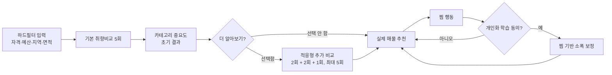

# 취향학습 질문·카테고리 중요도·가중치·찜 통합 설계

> 문서 목적: 가상 매물 비교형 취향학습의 질문 구성, 카테고리별 중요도 산출, 실제 매물 추천 가중치, 온보딩 이후 찜 행동 학습을 하나의 일관된 구조로 정의한다.  
> 적용 범위: 기본 8개 취향축, 기본 비교 5회 + 사용자 선택 추가 비교 최대 5회  
> 제외 범위: 자격·가격·면적 등 하드필터, 의료 접근 축, 조회·클릭 행동을 이용한 암묵적 학습  
> 문서 상태: 구현 기준안

---

## 1. 핵심 결정

이 설계의 핵심은 다음과 같다.

1. 온보딩에서는 실제 매물이 아니라 **가상 매물 두 개**를 비교한다.
2. 기본 5회는 네 개의 상위 카테고리를 넓게 탐색하고, 추가 최대 5회는 세부 취향을 분해한다.
3. 취향은 `카테고리 중요도 × 카테고리 안의 세부축 비중`으로 계산한다.
4. 카테고리별 중요도는 반드시 남기되, **선호 강도와 학습 신뢰도를 별도로 표시**한다.
5. 사용자가 “둘 다 비슷해요”를 선택해도 두 매물을 모두 선호한 것으로 처리하지 않는다.
6. 찜은 온보딩 결과를 대체하지 않고, 동의를 받은 경우에만 최대 25% 범위에서 점진적으로 보정한다.
7. 찜 해제는 비선호 행동으로 해석하지 않고, 현재 남아 있는 찜을 기준으로 다시 계산한다.
8. 추천 점수는 데이터가 없는 항목을 0점으로 처리하지 않고, 관측 가능한 항목만 재정규화한다.

---

## 2. 전체 학습 구조



하드필터와 취향학습은 역할을 구분한다.

| 구분 | 다루는 정보 | 추천에서의 역할 |
|---|---|---|
| 하드필터 | 자격, 보증금, 월세, 면적, 희망지역, 입주시기 | 후보 제외 또는 통과 |
| 취향학습 | 교통, 생활편의, 상권, 여가, 운동, 공원, 정온성 | 통과한 후보의 상대순위 |
| 설명용 태그 | 대학상권 등 복합 맥락, 자격 근거, 생활환경 설명 | 카드 설명과 추천 근거 |
| 찜 학습 | 추천 이후 사용자가 저장한 실제 후보의 공통 특성 | 기존 취향 가중치의 점진적 보정 |

---

## 3. 학습 대상: 4개 카테고리와 8개 세부축

### 3.1 최종 카테고리 구조

| 상위 카테고리 | 코드 | 세부 취향축 | 의미 |
|---|---|---|---|
| 이동·생활편의 | `G1_mobility_daily` | `rail_access`, `supermarket_access` | 대중교통과 일상 장보기의 편의 |
| 도시활동·사교 | `G2_urban_social` | `cafe_choice`, `restaurant_choice`, `culture_access` | 카페·외식·문화생활 선택지 |
| 건강·야외활동 | `G3_active_outdoor` | `fitness_access`, `park_walk` | 운동시설과 공원·산책 접근 |
| 정온·휴식 | `G4_quiet_rest` | `quiet_residential` | 생활밀도와 자극이 낮은 주거환경 |

### 3.2 세부 취향축 정의

| 축 코드 | 사용자 표시명 | 매물 카드에서 표현할 수 있는 내용 |
|---|---|---|
| `rail_access` | 역세권·철도 접근 | 가까운 도시철도·동해선 이용, 이동 편의 |
| `supermarket_access` | 장보기 편의 | 마트·생활소매 접근, 짧은 장보기 동선 |
| `cafe_choice` | 카페 선택지 | 주변 카페의 수와 다양성 |
| `restaurant_choice` | 외식 선택지 | 음식점의 수와 업종 다양성 |
| `culture_access` | 문화·여가 접근 | 문화시설과 여가시설 접근 |
| `fitness_access` | 운동시설 접근 | 헬스·체육시설 접근 |
| `park_walk` | 공원·산책 접근 | 도시공원과 녹지·산책 환경 |
| `quiet_residential` | 조용한 주거환경 | 낮은 생활밀도와 상업활동 자극 |

### 3.3 대학상권 태그의 위치

`대학상권`은 독립된 아홉 번째 학습축으로 두지 않는다. 대학 인접성만으로 사용자의 선호 방향을 단정하기 어렵고, 실제 효용은 카페·외식·문화 선택지 등 기존 축에 이미 나타나기 때문이다.

- 카드 설명: “대학가의 카페와 외식 선택지가 가까운 생활권”
- 학습 반영: 카드 A와 B의 실제 차이인 `cafe_choice`, `restaurant_choice`, `culture_access` 등에 분배
- 금지: 대학상권 선택 한 번으로 별도 `university_area` 가중치를 직접 올리는 방식

이 원칙은 하나의 선택이 중복된 여러 축에 이중 반영되는 것을 막는다.

---

## 4. 질문 카드의 공통 형식

모든 질문은 다음 구조를 사용한다.

### 4.1 상단 질문 영역

- 단계: `2 / 3 · 가상 매물 취향 학습`
- 진행률: `1 / 5` 또는 `7 / 10`
- 질문 유형: `취향 범위 탐색` 또는 `세부 취향 확인`
- 질문: 사용자가 비교해야 하는 생활 장면을 한 문장으로 제시
- 보조 설명: 무엇을 비교하는지 짧게 설명

### 4.2 가상 매물 카드

각 카드에는 다음 정보만 노출한다.

1. **대표 이미지**
   - 실제 매물 사진처럼 오인되지 않도록 가상 이미지 또는 생활권 콘셉트 이미지 사용
   - 이미지가 없으면 `지역 맥락 + 주택 유형` 조합 썸네일 사용
2. **자연스러운 타이틀 한 줄**
   - 예: “장전동 대학가에서 생활을 즐기기 좋은 행복주택 원룸”
   - 내부 조합값은 `[생활권 맥락] + [임대유형] + [주거형태]`
3. **생활환경 요약**
   - 예: “카페와 생활시설이 가까워 외출 동선이 짧아요.”
4. **핵심 태그 2~3개**
   - 질문에서 실제로 비교하는 축만 표시
5. **감수할 점 1개**
   - 예: “저녁에도 주변 활기가 이어질 수 있어요.”
6. **선택 버튼**
   - “이 매물이 더 끌려요”

### 4.3 공통 보조 선택지

- `둘 다 비슷해요`
- `둘 다 내 생활과 달라요`
- `이전 질문`

### 4.4 카드 생성 원칙

가상 매물은 실제 추천 후보가 아니며, 취향 차이를 잘 드러내기 위한 실험 자극이다.

- 가격·보증금·월세·자격·정확한 면적은 노출하지 않는다.
- 주거유형과 원룸·투룸 같은 표현은 현실감을 위한 맥락으로만 사용한다.
- 한 질문에서 비교하려는 핵심축 외의 조건은 가능한 한 동일하게 맞춘다.
- A와 B의 이미지 품질, 문장 길이, 긍정 표현 수를 비슷하게 맞춘다.
- 어느 한쪽이 항상 더 화려하거나 신축처럼 보이지 않게 한다.
- 카드 좌우 위치는 사용자별·질문별로 무작위 교차한다.
- 선택 결과는 카드 이름이 아니라 카드가 가진 축 벡터로 저장한다.

---

## 5. 기본 5회 질문 설계

기본 5회의 목표는 8개 세부축을 모두 정확하게 추정하는 것이 아니다. 네 개 상위 카테고리의 방향을 파악하고, 가장 중요한 카테고리 하나의 내부 취향을 처음 분리하는 것이다.

### Q1. 도시활동·사교 대 정온·휴식

**질문**

> 주말을 동네에서 즐기기와 조용히 충전하기 중 무엇이 좋나요?

**가상 매물 A**

- 타이틀: “카페와 문화생활을 가까이 누리는 도심형 행복주택 원룸”
- 태그: `카페 선택지`, `외식 선택지`, `문화·여가 접근`
- 감수할 점: “저녁에도 주변 활기가 이어질 수 있어요.”

**가상 매물 B**

- 타이틀: “차분한 골목에서 휴식하기 좋은 매입임대 원룸”
- 태그: `조용한 주거환경`
- 감수할 점: “다양한 여가를 즐기려면 다른 생활권으로 이동할 수 있어요.”

**학습 대상**

- `G2_urban_social` 대 `G4_quiet_rest`
- 선택된 카드의 상위 카테고리 중요도 상승

---

### Q2. 이동·생활편의 대 건강·야외활동

**질문**

> 평일의 편리한 이동과 가까운 운동·산책 중 어느 쪽이 더 중요한가요?

**가상 매물 A**

- 타이틀: “역과 장보기가 가까워 일상이 간결한 통합공공임대 원룸”
- 태그: `역세권·철도 접근`, `장보기 편의`
- 감수할 점: “녹지와 운동시설 선택지는 상대적으로 적을 수 있어요.”

**가상 매물 B**

- 타이틀: “운동과 산책을 일상으로 만들기 좋은 행복주택 원룸”
- 태그: `운동시설 접근`, `공원·산책 접근`
- 감수할 점: “철도 이동과 장보기 동선은 조금 길 수 있어요.”

**학습 대상**

- `G1_mobility_daily` 대 `G3_active_outdoor`

---

### Q3. 1·2번 승자 카테고리 연결

Q1에서 선택된 카테고리와 Q2에서 선택된 카테고리를 비교한다.

**예시 질문**

> 이동이 편한 생활과 동네 여가가 풍부한 생활 중 어느 쪽이 더 끌리나요?

**생성 원칙**

- Q1 승자와 Q2 승자를 각각 대표하는 가상 매물 생성
- 같은 카테고리 안에서는 여러 세부축을 균형 있게 사용
- 특정 세부축 하나만으로 카테고리 전체를 대표하지 않도록 함

**학습 대상**

- 사용자의 상위 1·2순위 카테고리 분리

---

### Q4. 불확실한 카테고리 관계 보완

현재까지 선택 확률이 가장 비슷하거나 비교 연결이 약한 두 카테고리를 비교한다.

**예시**

- `도시활동·사교`와 `건강·야외활동`의 중요도가 비슷하면 두 카테고리를 비교
- `정온·휴식`이 한 번만 등장했다면 정온 카테고리가 포함된 질문을 우선

**학습 대상**

- 네 개 카테고리 순위의 불확실성 축소
- 특정 카테고리가 한 번도 직접 또는 간접 비교되지 않는 상황 방지

---

### Q5. 최상위 다중축 카테고리의 첫 세부 분리

현재 가장 중요한 것으로 추정된 카테고리 안에서 세부축을 비교한다.

| 최상위 카테고리 | Q5 비교 |
|---|---|
| 이동·생활편의 | 역세권·철도 접근 대 장보기 편의 |
| 도시활동·사교 | 카페·외식 중심 대 문화·여가 중심 |
| 건강·야외활동 | 운동시설 접근 대 공원·산책 접근 |
| 정온·휴식 | 단일축이므로 차상위 다중축 카테고리의 세부 비교로 대체 |

**도시활동·사교의 후속 처리**

이 카테고리는 세부축이 세 개이므로 Q5 한 번으로 완전히 분리하지 않는다. 우선 `카페+외식`과 `문화`를 비교하고, 추가 질문에서 카페와 외식을 분리한다.

---

## 6. 추가 선택 최대 5회

### 6.1 사용자 흐름

기본 5회 후 다음과 같이 제안한다.

> 현재는 큰 취향 방향을 파악했어요. 두 번 더 비교하면 가장 중요한 생활환경을 더 정확히 나눌 수 있어요.

추가 질문은 한 번에 5회를 강요하지 않는다.

- 1차: 2회 추가
- 2차: 2회 추가
- 마지막: 필요할 때 1회 추가
- 전체 누적 상한: 10회
- 매 묶음 종료 후 바로 추천으로 이동 가능

### 6.2 추가 질문 우선순위

#### Q6. 최상위 카테고리의 미분리 세부축

- Q5에서 다 분리하지 못한 최상위 카테고리의 세부축 비교
- 도시활동·사교가 최상위라면 카페 대 외식 비교가 우선

#### Q7. 두 번째 중요 카테고리의 세부축

- 추천 상위권의 순위를 실제로 바꿀 가능성이 큰 두 번째 카테고리 내부 비교

#### Q8. 미학습 세부축 보완

- 아직 직접 비교에 등장하지 않은 세부축을 우선 포함
- 단, 해당 축의 실제 매물 간 분산이 거의 없으면 우선순위를 낮춤

#### Q9. 추천 순위 영향이 큰 불확실성 해소

- 현재 가중치가 조금만 달라져도 추천 상위 3개가 바뀌는 축을 비교

#### Q10. 기대 정보량이 가장 큰 마지막 질문

- 남은 질문 후보 중 불확실성 감소와 추천순위 개선 효과가 가장 큰 질문 선택
- 동일·유사 질문을 다시 내는 일관성 검사는 사용하지 않음

### 6.3 질문 선택 점수

추가 질문 후보 `q`의 우선순위를 다음과 같이 계산한다.

```text
QuestionPriority(q)
  = 0.40 × UncertaintyReduction(q)
  + 0.30 × RankingImpact(q)
  + 0.20 × CoverageGain(q)
  + 0.10 × CandidateVariance(q)
  - RepetitionPenalty(q)
```

| 항목 | 의미 |
|---|---|
| `UncertaintyReduction` | 선택 결과가 현재 비슷한 가중치를 얼마나 잘 분리하는가 |
| `RankingImpact` | 해당 차이가 실제 추천 상위권을 얼마나 바꿀 수 있는가 |
| `CoverageGain` | 아직 충분히 등장하지 않은 카테고리를 보완하는가 |
| `CandidateVariance` | 실제 후보들 사이에 해당 특성 차이가 충분한가 |
| `RepetitionPenalty` | 최근 질문과 같은 축·문장·이미지를 반복하는 정도 |

### 6.4 조기 종료

사용자가 원하면 언제든 추천으로 이동할 수 있다. 시스템도 다음 조건을 모두 만족하면 추가 질문의 필요성을 낮게 안내할 수 있다.

- 추천 상위 3개가 최근 두 번의 업데이트에서 안정적임
- 상위 카테고리의 세부축 분포가 충분히 구분됨
- 다음 질문의 기대 순위 개선량이 기준값보다 낮음

---

## 7. 선택값의 해석

### 7.1 A 또는 B 선택

- 선택된 카드가 가진 특성 조합이 상대적으로 더 중요하다는 증거
- 선택되지 않은 카드의 특성을 “싫어함”으로 단정하지 않음
- 두 카드의 차이가 있는 축에만 업데이트 적용

### 7.2 둘 다 비슷해요

이 선택은 “둘 다 좋다”가 아니라 **현재 제시된 차이만으로 우열을 정하기 어렵다**는 뜻이다.

MVP 처리:

- 방향성 가중치는 올리거나 내리지 않음
- 해당 질문의 두 선택효용 차이가 작다는 관측으로 기록
- 유사한 대비를 반복하지 않고 더 큰 차이 또는 다른 축의 질문을 제시

고도화 처리:

```text
tie_loss = 0.5 × (utility_A - utility_B)²
```

즉 두 카드의 추정 효용 차이가 줄어들도록 약하게 학습할 수 있다. 다만 초기 MVP에서는 과도한 모델 복잡성을 피하기 위해 무방향 기록만 사용한다.

### 7.3 둘 다 내 생활과 달라요

- 두 카드 모두 사용자의 절대적 선호 기준에 맞지 않는다는 신호
- 두 카드 중 어느 축이 싫은지 분리할 수 없으므로 곧바로 음수 가중치로 바꾸지 않음
- 서로 다른 생활환경을 가진 새 카드 조합으로 교체
- 반복적으로 발생하면 별도 “피하고 싶은 환경” 질문을 제안할 수 있으나, 현재 기본 모델에는 포함하지 않음

### 7.4 이전 질문

- 직전 응답을 삭제한 뒤 전체 응답 이력으로 가중치를 재계산
- 새 선택이 확정되기 전에는 삭제된 응답의 효과를 추천에 사용하지 않음
- 단순 역연산보다 전체 이력 재생 방식이 수치 오류와 중복 업데이트를 막는 데 안전함

---

## 8. 카테고리 중요도와 세부 가중치 모델

### 8.1 왜 계층형 가중치가 필요한가

현재 서비스에서 보여주려는 값은 “좋음·싫음”이 아니라 **추천에서 무엇을 얼마나 중요하게 볼지**이다. 따라서 음수와 양수가 섞인 세부축의 평균을 카테고리 중요도로 사용하면 안 된다.

예를 들어 한 카테고리에서 카페가 `+0.8`, 문화가 `-0.8`이면 평균은 0이 된다. 이것은 그 카테고리가 중요하지 않다는 뜻이 아니라 카테고리 내부에서 선호가 갈린다는 뜻이다. 또한 세부축이 3개인 카테고리와 1개인 카테고리를 단순 합계로 비교하면 태그 수가 많은 카테고리가 유리해진다.

이를 해결하기 위해 다음 두 층을 분리한다.

1. `α_g`: 네 개 카테고리 사이의 중요도
2. `β_j|g`: 같은 카테고리 안에서 세부축의 상대 비중

최종 세부 가중치는 두 값을 곱한다.

```text
w_j = α_g × β_j|g
```

항상 다음을 만족한다.

```text
Σ_g α_g = 1
Σ_(j∈g) β_j|g = 1
Σ_j w_j = 1
w_j ≥ 0
```

### 8.2 내부 파라미터

사용자별로 다음 잠재 파라미터를 저장한다.

| 파라미터 | 의미 |
|---|---|
| `a_g` | 카테고리 중요도 로짓 |
| `b_j` | 카테고리 내부 세부축 로짓 |
| `α_g` | 화면에 표시할 카테고리 중요도 |
| `β_j|g` | 카테고리 안의 세부축 비중 |
| `w_j` | 실제 추천에 사용하는 최종 세부 가중치 |

카테고리 중요도는 softmax로 계산한다.

```text
α_g = exp(a_g / τ_category)
      / Σ_h exp(a_h / τ_category)
```

카테고리 내부 세부축 비중도 softmax로 계산한다.

```text
β_j|g = exp(b_j / τ_leaf)
        / Σ_(k∈g) exp(b_k / τ_leaf)
```

초기 권장값:

```text
τ_category = 0.7
τ_leaf = 0.7
```

온도값이 낮을수록 작은 선택 차이가 큰 중요도 차이로 나타난다. 위 값은 시작값이며, 실제 사용자 선택 시뮬레이션과 파일럿 테스트로 보정해야 한다.

### 8.3 초기값

비교 전에는 모든 로짓을 0으로 둔다.

```text
a_g = 0
b_j = 0
```

따라서 수학적으로 카테고리 중요도는 각 25%로 시작하고, 세부축은 카테고리 안에서 균등하다.

| 카테고리 | 초기 `α` | 초기 `β` |
|---|---:|---|
| 이동·생활편의 | 25% | 철도 50%, 장보기 50% |
| 도시활동·사교 | 25% | 카페 33.3%, 외식 33.3%, 문화 33.3% |
| 건강·야외활동 | 25% | 운동 50%, 공원 50% |
| 정온·휴식 | 25% | 조용함 100% |

단, 이 값은 “사용자가 네 범주를 똑같이 좋아한다”는 결론이 아니다. 학습 전 중립 prior이므로 화면에는 `아직 학습 전` 또는 `근거 부족`으로 표시한다.

---

## 9. 비교 선택으로 가중치를 갱신하는 방법

### 9.1 가상 매물 특성 벡터

각 가상 매물은 8개 취향축에 대한 정규화 벡터를 가진다.

```text
x_i = [
  rail_access,
  supermarket_access,
  cafe_choice,
  restaurant_choice,
  culture_access,
  fitness_access,
  park_walk,
  quiet_residential
]
```

각 값은 원칙적으로 `0~1` 범위이며, 질문 생성 시 비교하려는 축만 유의미하게 다르게 만든다.

### 9.2 선택 확률

현재 사용자 가중치에서 매물 A와 B의 효용 차이를 계산한다.

```text
U(A) - U(B) = Σ_j w_j × (x_Aj - x_Bj)
```

사용자가 A를 선택할 확률은 다음과 같이 모델링한다.

```text
P(A 선택) = sigmoid(κ × (U(A) - U(B)))
```

초기 권장값:

```text
κ = 3.0
```

`κ`는 선택의 민감도다. 값이 너무 크면 한두 번의 응답에 과도하게 확신하고, 너무 작으면 10번을 물어도 차이가 잘 생기지 않는다.

### 9.3 온라인 업데이트

A 선택을 `y=1`, B 선택을 `y=0`으로 두고 로지스틱 손실을 최소화하도록 관련 로짓을 갱신한다.

```text
loss
  = -y log P(A)
    -(1-y) log(1-P(A))
    + λ(||a||² + ||b||²)
```

권장 시작값:

| 구간 | 학습률 |
|---|---:|
| 기본 5회 | `0.35` |
| 추가 질문 | `0.25` |
| L2 정규화 `λ` | `0.02` |

기본 5회는 방향을 빠르게 잡기 위해 조금 크게, 추가 질문은 기존 결과를 세밀하게 다듬기 위해 작게 둔다.

실제 업데이트 범위:

- 서로 다른 카테고리 비교: 관련 `a_g`를 중심으로 갱신
- 같은 카테고리의 세부축 비교: 관련 `b_j`를 중심으로 갱신
- 카테고리와 세부축이 모두 다른 혼합 질문: `a_g`와 `b_j`를 함께 갱신
- 두 카드에서 값이 같은 축: 갱신하지 않음

### 9.4 기본 5회 완료 시 해석

기본 5회만 완료한 사용자는 다음 상태로 본다.

- 네 개 상위 카테고리: 초기 개인화가 가능한 수준
- 최상위 카테고리 일부 세부축: 제한적인 초기 분리
- 나머지 세부축: prior의 영향이 큰 상태
- 결과 표현: `초기 취향`, `탐색 결과`, `낮음~보통 신뢰도`

따라서 5회를 “8개 축의 충분한 학습 완료”로 표현하면 안 된다. 5회는 추천을 시작하기 위한 최소 정보이며, 추가 질문과 찜이 세부축을 보완한다.

---

## 10. 카테고리별 중요도 화면 설계

### 10.1 표시값

화면에는 `α_g × 100`을 반올림한 비율을 표시하고, 반올림 오차를 조정해 합계가 100%가 되게 한다.

예시:

| 카테고리 | 중요도 | 신뢰도 | 설명 |
|---|---:|---|---|
| 도시활동·사교 | 36% | 보통 | 동네에서 누리는 카페·외식·문화 선택을 중요하게 봐요 |
| 이동·생활편의 | 29% | 보통 | 이동과 장보기 동선이 짧은 생활을 선호해요 |
| 건강·야외활동 | 22% | 낮음 | 운동과 산책 중 어떤 쪽이 더 중요한지 추가 확인이 필요해요 |
| 정온·휴식 | 13% | 보통 | 조용함은 다른 생활 요소보다 후순위로 나타났어요 |

### 10.2 중요도와 신뢰도의 분리

중요도와 신뢰도는 다른 개념이다.

- 중요도: 현재 모델이 추정한 상대적 우선순위
- 신뢰도: 그 추정을 뒷받침하는 선택 증거가 얼마나 충분한지

신뢰도 계산에는 다음을 사용한다.

```text
Confidence_g
  = 0.35 × ComparisonCountScore_g
  + 0.25 × GraphCoverageScore_g
  + 0.25 × StabilityScore_g
  + 0.15 × SeparationScore_g
```

| 요소 | 의미 |
|---|---|
| 비교 횟수 | 해당 카테고리가 유효한 비교에 등장한 횟수 |
| 그래프 연결성 | 다른 카테고리들과 직접·간접 비교되었는지 |
| 안정성 | 최근 응답을 하나 제외해도 순위가 유지되는지 |
| 분리도 | 인접 카테고리와 중요도 차이가 충분한지 |

권장 표시:

- `낮음`: 0.45 미만
- `보통`: 0.45 이상 0.70 미만
- `높음`: 0.70 이상

이 기준 역시 파일럿 데이터로 보정한다.

### 10.3 세부 취향 표시

카테고리 내부의 `β`가 충분히 학습되었을 때만 세부축 비중을 표시한다.

예시:

```text
도시활동·사교 36%
├─ 외식 선택지 45%
├─ 카페 선택지 35%
└─ 문화·여가 접근 20%
```

세부 비교가 부족하면 억지로 숫자를 보여주지 않고 다음처럼 표시한다.

> 도시활동·사교가 중요한 것은 확인했지만, 카페·외식·문화 중 무엇이 더 중요한지는 추가 비교가 필요해요.

### 10.4 사용자의 직접 조정

사용자는 카테고리를 `우선`, `자동`, `후순위`로 조정할 수 있다. 이 값은 음수 가중치가 아니라 배율로 적용한다.

| 사용자 설정 | 배율 |
|---|---:|
| 우선 | `1.5` |
| 자동 | `1.0` |
| 후순위 | `0.6` |

```text
α'_g = normalize(α_g × manual_multiplier_g)
```

직접 조정된 카테고리는 잠금 상태로 기록하고 찜 학습이 그 의도를 뒤집지 못하게 한다. 사용자가 `자동`으로 되돌리면 모델 추정값을 다시 사용한다.

---

## 11. 실제 매물 추천 점수

### 11.1 매물 특성값

실제 매물 `i`에도 동일한 8개 축의 정규화값 `x_ij`를 부여한다.

- 동일 축 안에서 부산 전체 매물을 기준으로 정규화
- 값이 클수록 해당 생활 특성이 강함
- 원천데이터의 연도와 공간범위가 다르면 품질 플래그를 함께 저장
- 설명용 태그는 점수에 중복 가산하지 않음

### 11.2 추천 점수

```text
PreferenceScore(i)
  = 100 ×
    Σ_(j∈Observed_i) w_j × x_ij
    / Σ_(j∈Observed_i) w_j
```

결측 축은 0점이 아니라 분모와 분자에서 모두 제외한다. 단, 관측 축이 너무 적은 매물은 점수와 함께 `데이터 신뢰도 낮음`을 표시하거나 추천 상위권에서 제한한다.

### 11.3 최종 순위

1. 하드필터 통과 후보만 남김
2. 사용자 직접 카테고리 설정 반영
3. 온보딩·찜을 결합한 최종 세부 가중치 적용
4. 관측 가능한 축으로 개인화 점수 계산
5. 동점권에서는 데이터 완전성, 공고 확정성, 정보 최신성을 보조 기준으로 사용

자격이나 가격을 취향점수에 섞지 않는다. 자격 불충족 매물이 높은 취향점수를 받아 노출되는 일을 막기 위해서다.

---

## 12. 찜 행동을 이용한 지속학습

### 12.1 기본 원칙

찜은 단순 클릭보다 강한 선호 신호이지만 다음 한계가 있다.

- 사용자는 가격, 공고상태, 사진 때문에 찜할 수도 있음
- 추천 화면에 노출되지 않은 매물은 찜할 기회가 없음
- 같은 단지의 유사 세대를 여러 개 찜하면 특정 특성이 과대표현될 수 있음
- 찜 해제는 실수 정정일 수 있어 곧바로 비선호로 볼 수 없음

따라서 찜은 온보딩을 대체하지 않고 제한적으로 반영한다.

### 12.2 동의 흐름

최초 찜 시 한 번만 묻는다.

> 찜한 매물의 공통 생활환경을 다음 추천에 반영할까요?

- 기본값: 동의하지 않음
- 동의 시점 이후의 찜만 사용하거나, 과거 찜 포함 여부를 명확히 안내
- 설정에서 언제든 학습 중지·초기화 가능
- 학습 동의와 찜 목록 저장 동의는 구분

### 12.3 노출 대비 찜 신호

찜한 매물의 평균만 보면 원래 추천 시스템이 많이 노출한 특성을 사용자가 좋아한다고 잘못 판단할 수 있다. 따라서 실제 노출 후보를 기준선으로 사용한다.

```text
s_j
  = mean(x_ij | 사용자가 찜한 고유 매물)
  - mean(x_ij | 사용자에게 실제 노출된 고유 매물)
```

해석:

- `s_j > 0`: 노출된 후보에 비해 찜 매물에 해당 특성이 더 많음
- `s_j ≈ 0`: 찜 여부를 구분하는 증거가 약함
- `s_j < 0`: 찜 매물에 상대적으로 덜 나타남

노출 이력을 저장하지 못한 초기 버전에서는 하드필터 통과 후보 전체의 평균을 임시 기준선으로 사용한다. 구현 목표는 반드시 사용자별 노출 기준선으로 전환하는 것이다.

### 12.4 중복 방지와 데이터 품질

- 동일 단지·동일 좌표·유사 면적의 여러 세대는 하나의 찜 묶음으로 계산
- 같은 묶음에서 여러 건을 찜해도 학습 가중치는 1건과 동일
- 해당 축 데이터가 결측인 매물은 그 축의 평균 계산에서 제외
- 품질이 낮거나 추정된 특성은 신뢰도 계수를 곱해 약하게 반영
- 사용자가 직접 검색해 들어온 매물과 추천으로 노출된 매물을 구분해 기록

### 12.5 찜 선호분포

찜 대비 신호를 8개 축의 비음수 분포로 변환한다.

```text
q_j = softmax(s_j / τ_favorite)
```

권장 시작값:

```text
τ_favorite = 0.35
```

찜 데이터가 전혀 없을 때는 `q`를 사용하지 않는다. 한 축의 음수 대비값은 그 축을 싫어한다는 확정 판정이 아니라 다른 축의 상대 비중을 높이는 데만 사용한다.

### 12.6 찜 반영 비율

활성화된 고유 찜 묶음 수를 `n`이라고 할 때 반영률은 다음과 같다.

```text
ρ(n) = 0.25 × (1 - exp(-n / 4))
```

| 고유 찜 수 | 찜 반영률 `ρ` 약값 |
|---:|---:|
| 1 | 5.5% |
| 2 | 9.8% |
| 3 | 13.2% |
| 5 | 17.8% |
| 8 | 21.6% |
| 10 | 22.9% |
| 매우 많음 | 최대 25% |

초기 한두 번의 찜이 온보딩 결과를 뒤집지 못하게 하고, 찜이 누적될수록 효과가 증가하되 최대 25%에서 포화시킨다.

### 12.7 온보딩과 찜 가중치 결합

```text
w_blended
  = normalize(
      (1 - ρ) × w_onboarding
      + ρ × q_favorite
    )
```

그 후 카테고리 중요도를 다시 계산한다.

```text
α_blended_g = Σ_(j∈g) w_blended_j

β_blended_j|g
  = w_blended_j / α_blended_g
```

마지막으로 사용자의 직접 카테고리 조정 배율을 적용한다.

```text
α_final_g
  = normalize(
      α_blended_g × manual_multiplier_g
    )

w_final_j
  = α_final_g × β_blended_j|g
```

적용 순서를 `온보딩 → 찜 보정 → 사용자 직접 설정`으로 두기 때문에 명시적으로 정한 우선·후순위가 자동학습에 의해 사라지지 않는다.

### 12.8 찜 해제

찜 해제 시 다음처럼 처리한다.

1. 해제된 매물을 활성 찜 집합에서 제거
2. 남은 활성 찜으로 `s`, `q`, `ρ`를 전부 재계산
3. 해제 자체를 음수 학습 신호로 추가하지 않음
4. 활성 찜이 0개가 되면 온보딩 가중치로 복귀

### 12.9 사용자에게 보여줄 피드백

- “최근 찜 3개의 생활환경이 추천에 13% 반영되고 있어요.”
- “찜한 매물에서 공원·산책 접근이 공통적으로 높게 나타났어요.”
- “찜 학습 끄기”
- “찜으로 배운 취향 초기화”

학습 근거를 사용자에게 설명할 수 있어야 하며, 내부 수치만 조용히 바꾸지 않는다.

---

## 13. 전체 계산 예시

### 13.1 온보딩 결과

기본·추가 질문을 거쳐 다음 카테고리 중요도가 산출되었다고 가정한다.

| 카테고리 | `α` |
|---|---:|
| 이동·생활편의 | 30% |
| 도시활동·사교 | 35% |
| 건강·야외활동 | 20% |
| 정온·휴식 | 15% |

카테고리 내부 비중:

| 카테고리 | 세부 비중 `β` |
|---|---|
| 이동·생활편의 | 철도 60%, 장보기 40% |
| 도시활동·사교 | 카페 30%, 외식 45%, 문화 25% |
| 건강·야외활동 | 운동 35%, 공원 65% |
| 정온·휴식 | 조용함 100% |

최종 세부 가중치:

| 축 | 계산 | `w_onboarding` |
|---|---:|---:|
| 철도 접근 | 0.30 × 0.60 | 18.00% |
| 장보기 편의 | 0.30 × 0.40 | 12.00% |
| 카페 선택지 | 0.35 × 0.30 | 10.50% |
| 외식 선택지 | 0.35 × 0.45 | 15.75% |
| 문화 접근 | 0.35 × 0.25 | 8.75% |
| 운동시설 | 0.20 × 0.35 | 7.00% |
| 공원·산책 | 0.20 × 0.65 | 13.00% |
| 조용한 환경 | 0.15 × 1.00 | 15.00% |
| 합계 |  | 100.00% |

### 13.2 찜 3개 반영

고유 찜 3개에서 공원과 조용함이 노출 대비 높게 나타났다고 가정한다.

```text
ρ(3) ≈ 13.2%
```

온보딩 가중치 86.8%와 찜 선호분포 13.2%를 혼합한다. 카테고리별 중요도 화면도 혼합된 세부 가중치의 합으로 갱신한다.

이때 사용자에게는 다음처럼 설명한다.

> 처음 비교에서는 도시활동을 가장 중요하게 봤지만, 최근 찜한 매물에서는 공원·산책 환경이 반복적으로 나타나 건강·야외활동 비중이 소폭 높아졌어요.

---

## 14. 저장 데이터 구조

```ts
type PreferenceLearningState = {
  modelVersion: string;

  categoryLogits: Record<CategoryId, number>;
  leafLogits: Record<PreferenceAxisId, number>;

  categoryImportance: Record<CategoryId, number>;
  withinCategoryShare: Record<PreferenceAxisId, number>;
  onboardingWeights: Record<PreferenceAxisId, number>;
  finalWeights: Record<PreferenceAxisId, number>;

  answers: Array<{
    questionId: string;
    leftCardId: string;
    rightCardId: string;
    response: "left" | "right" | "tie" | "reject";
    featureDelta: Record<PreferenceAxisId, number>;
    answeredAt: string;
  }>;

  shownListingIds: string[];
  favoriteListingIds: string[];
  favoriteLearningConsent: boolean;

  manualCategorySetting: Record<
    CategoryId,
    "priority" | "auto" | "lower"
  >;

  confidenceByCategory: Record<CategoryId, number>;
  completedComparisonCount: number;
};
```

추가 저장 원칙:

- `modelVersion` 변경 시 기존 응답을 재생해 새 가중치를 만들 수 있게 원본 응답 보존
- 가상 카드의 표시문구뿐 아니라 실제 특성 벡터 저장
- 노출 ID와 노출 시각 저장
- 동일 단지 중복 판정을 위한 `complexKey` 저장
- 사용자가 학습을 초기화하면 응답·가중치·찜 학습 상태를 명확히 분리해 삭제

---

## 15. 구현 순서

### 1단계. 질문·카테고리 정합성 수정

- 8개 축은 유지
- 카테고리를 이 문서의 네 묶음으로 통일
- 기본 5회 질문 템플릿 구현
- 추가 질문 누적 상한을 10회로 통일

### 2단계. 계층 가중치

- 카테고리 로짓과 세부축 로짓 분리
- softmax 기반 `α`, `β`, `w` 계산
- 선택 이력 재생 방식 구현
- 중요도와 신뢰도 분리 표시

### 3단계. 적응형 추가 질문

- 질문 후보 생성
- 불확실성·순위영향·커버리지 계산
- `2회 + 2회 + 1회` 추가 흐름
- 조기 종료 조건 적용

### 4단계. 실제 추천 연결

- 태그 산출값을 8개 공통 축으로 정규화
- 결측값 제외 재정규화
- 추천 근거와 감수할 점 생성
- 설명용 결합태그의 중복 가산 방지

### 5단계. 찜 지속학습

- 최초 찜 시 동의
- 사용자별 노출 로그
- 동일 단지 중복 제거
- 포화형 반영률 `ρ`
- 찜 해제 시 전체 재계산
- 학습 근거·중지·초기화 UI

---

## 16. 검증 계획

### 16.1 오프라인 시뮬레이션

서로 다른 가상 사용자 가중치를 만들고 질문에 확률적으로 응답하게 한다.

비교 조건:

- 기본 5회
- 5회 + 추가 2회
- 5회 + 추가 4회
- 전체 10회
- 찜 1·3·5·10개 누적

평가 지표:

| 지표 | 목적 |
|---|---|
| 가중치 코사인 유사도 | 추정 취향이 실제 가상 취향과 얼마나 가까운지 |
| 카테고리 1순위 정확도 | 가장 중요한 상위 카테고리를 맞추는지 |
| Top-3 일치율 | 실제 추천 상위 후보와 추정 추천 후보가 겹치는지 |
| NDCG@K | 추천 순서의 품질 |
| 질문당 정보이득 | 추가 질문의 효율 |
| 찜 전후 변동폭 | 찜 한두 개가 결과를 과도하게 흔드는지 |

### 16.2 사용자 경험 지표

- 기본 5회 완료율
- 질문별 응답시간
- `둘 다 비슷해요` 비율
- `둘 다 내 생활과 달라요` 비율
- 추가 2회 선택률
- 10회까지 완료한 비율
- 취향 결과 수정률
- 추천 후 찜 전환율
- 찜 학습 동의율과 해제율

### 16.3 반드시 비교할 대안

- 카테고리 단순 평균 대 계층형 가중치
- 고정 10문항 대 기본 5회 + 적응형 추가
- 전체 후보 평균 기준 찜 학습 대 실제 노출 평균 기준 찜 학습
- 선형 찜 반영률 대 포화형 반영률

---

## 17. 현재 구현에서 수정이 필요한 핵심 사항

최신 구현 상태를 이 설계와 맞출 때 확인해야 할 항목이다.

| 현재 방식 | 문제 | 목표 방식 |
|---|---|---|
| 카테고리 안의 signed 세부 가중치 평균 | 양수·음수 상쇄, 중요도 해석 곤란 | `α × β` 계층형 비음수 중요도 |
| `운동+마트`, `조용함+공원` 묶음 | 질문 설계의 생활 맥락과 불일치 | 이동·생활편의, 건강·야외활동, 정온·휴식으로 재정렬 |
| 카테고리 직접 설정 시 세부축에 `+0.4/-0.4` | 후순위를 비선호로 오해할 수 있음 | `1.5/1.0/0.6` 배율 후 재정규화 |
| 기본 5회 이후 최대 누적 15회 | 사용자가 이해하는 범위와 문서가 불일치 | 기본 5회 + 선택 최대 5회, 총 10회 |
| 찜 매물 평균과 전체 후보 평균 비교 | 실제 노출 편향 미보정 | 찜 평균과 사용자별 노출 평균 비교 |
| 찜 수에 선형 비례해 최대 25% | 초반 변화가 기계적이고 불연속적 | 포화함수 `ρ(n)` |
| `둘 다 비슷` 무조건 폐기 | 질문 선택 개선에 정보 미사용 | 방향 갱신은 하지 않되 다음 질문 생성에 활용 |

---

## 18. 최종 운영 규칙 요약

1. 기본 5회는 네 카테고리의 초기 순위를 만드는 최소 탐색이다.
2. 추가 최대 5회는 상위 카테고리 내부의 8개 세부축을 더 정밀하게 나눈다.
3. 카테고리 중요도 `α`와 세부 비중 `β`를 분리하고 최종 추천 가중치는 `w=α×β`로 계산한다.
4. 화면에는 카테고리 중요도 합계 100%와 별도의 신뢰도를 함께 보여준다.
5. 사용자의 `우선/자동/후순위` 설정은 음수가 아닌 배율로 적용하고 자동학습보다 우선한다.
6. “둘 다 비슷”은 공동 선호가 아니며, 우열 없음으로 기록한다.
7. 실제 매물 점수는 관측 가능한 축만 재정규화해 계산한다.
8. 찜은 동의 후에만 사용하고, 노출 대비 찜 특성으로 계산한다.
9. 찜 영향은 1개 약 5.5%에서 시작해 최대 25%로 포화한다.
10. 찜 해제는 비선호가 아니라 해당 찜의 증거 제거로 처리한다.
11. 대학상권 같은 설명용 태그는 카드 설명에는 쓰되 기존 세부축과 중복 가산하지 않는다.
12. 모든 상수는 구현 초기값이며, 가상 사용자 시뮬레이션과 파일럿 데이터로 보정한다.

